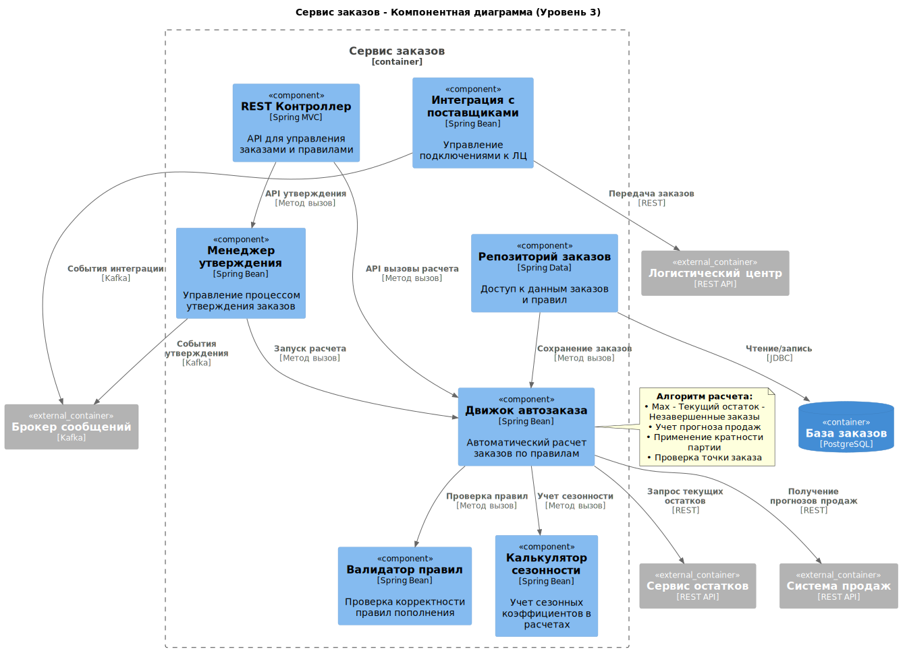

# Компонентная архитектура

## **Требования, обосновывающие выбор микросервисной архитектуры**

### **Масштабируемость до 100 ресторанов**

**Исходное требование (из контекста):**
> *"Если проект будет успешен, мы масштабируем нашу систему на все рестораны. Всего ресторанов около 100."*

**Обоснование для микросервисов:**

- **Независимое масштабирование:** Сервис автозаказа будет нагружен пропорционально количеству ресторанов, в то время как сервис управления справочниками - нет. Микросервисы позволяют масштабировать только нужные компоненты.
- **Географическое распределение:** Для сети ресторанов может потребоваться распределенное развертывание ближе к регионам.

### **Интеграция с разнородными внешними системами**

**Исходное требование (FR6.1, FR6.2):**

> **FR6.1:** Система должна предоставлять API для роботизированной линии...
> **FR6.2:** Система должна предоставлять API для обмена данными с системой Логистического Центра...

**Обоснование для микросервисов:**

- **Изоляция интеграций:** Каждая внешняя система (робот, ЛЦ) имеет свой протокол и SLA. Микросервисы позволяют изолировать проблемы интеграции.
- **Независимое развитие:** Изменения в API ЛЦ не должны затрагивать сервис работы с роботизированной линией.

### **Критичные требования к производительности и доступности**

**Исходное требование (NFR для UC11):**

> **NFR:** Время от момента отправки запроса роботом до получения ответа должно быть **минимальным (< 100 мс)**... **доступность 99.99%**.

**Обоснование для микросервисов:**

- **Выделение критичных компонентов:** Сервис проверки сроков годности требует максимальной производительности и может быть развернут на более мощном оборудовании.
- **Изоляция сбоев:** Проблемы в менее критичных сервисах (например, отчетности) не должны влиять на работу производственной линии.

### **Разные модели данных и паттерны доступа**

**Исходное требование (из анализа процессов):**
> *Операции с роботом требуют реального времени, формирование отчетов - пакетной обработки, работа с заказами - транзакционности.*

**Обоснование для микросервисов:**

- **Оптимизация БД:** Сервис работы с роботом может использовать in-memory БД, сервис отчетов - колоночную БД, сервис заказов - реляционную транзакционную БД.
- **Разные архитектурные паттерны:** CQRS для отчетов, Event Sourcing для аудита движений запасов.

### **Независимость жизненных циклов компонентов**

**Исходное требование (из этапов реализации):**
> *MVP включает базовый функционал, Релиз 1.0 добавляет интеграции и автоматизацию.*

**Обоснование для микросервисов:**

- **Независимые релизы:** Можно развивать и выпускать новые версии сервиса автозаказа, не затрагивая работающий сервис инвентаризации.
- **Поэтапное внедрение:** В MVP можно реализовать монолит, а в Релизе 1.0 выделить критические сервисы.

### **Разные команды разработки**

**Исходное требование (подразумеваемое):**
> *Разные экспертизы: интеграции с оборудованием, бизнес-логика заказов, аналитика и отчетность.*

**Обоснование для микросервисов:**

- **Независимые команды:** Команда интеграций может работать с API робота, команда аналитики - с системой отчетности.
- **Технологический стек:** Каждая команда может выбирать оптимальный стек технологий для своей предметной области.

## **Обоснование выбора архитектурного стиля**

Для MVP может быть целесообразно начать с модульного монолита, заложив границы будущих сервисов, и выделять микросервисы по мере роста нагрузки и команды.

## Диаграмма контекста

## Диаграммы контейнеров

Далее диаграмму разделил на две части, чтобы было удобнее описывать и все было хорошо видно. Некоторые сервисы повторяются на диаграммах и могут быть реализованы в одном экземпляре (на усмотрение разработчика).

### Часть сервисов по автозаказу, логистике и по инвентаризации

### Часть сервисов по контролю срока годности и пополнению оперативного запаса 

### **Таблица контейнеров системы управления запасами**

#### **Frontend контейнеры**

| Контейнер | Тип | Назначение | Технологии |
|-----------|-----|------------|------------|
| Веб-приложение | Веб-приложение | Управление для технолога и администратора: заказы, настройки, отчеты | React, TypeScript |
| Мобильное приложение | Мобильное приложение | Задания и инвентаризация для оператора: оффлайн-режим, сканирование штрих-кодов | React Native |

#### **Backend бизнес-сервисы**

| Контейнер | Тип | Назначение | Технологии |
|-----------|-----|------------|------------|
| Сервис остатков | Микросервис | Управление партиями, остатками, FEFO, перемещениями | Spring Boot, PostgreSQL |
| Сервис контроля сроков | Микросервис | Блокировка партий, расчет виртуальных сроков, автоматическая утилизация | Spring Boot, Redis |
| Сервис заданий | Микросервис | Управление заданиями операторам: утилизация, пополнение, приоритизация | Spring Boot, PostgreSQL |
| Сервис заказов | Микросервис | Автозаказ, правила пополнения, интеграция с ЛЦ | Spring Boot, PostgreSQL |
| Сервис оперативного запаса | Микросервис | Управление запасом на роботизированной линии, пополнение | Spring Boot, Redis |
| Сервис интеграции с роботом | Микросервис | Реальное время взаимодействие с роботом, проверка сроков | Spring Boot, gRPC, WebSocket |

#### **Инфраструктурные сервисы**

| Контейнер | Тип | Назначение | Технологии |
|-----------|-----|------------|------------|
| API Gateway | Шлюз API | Единая точка входа, маршрутизация, аутентификация | Spring Cloud Gateway |
| Сервис аутентификации | Микросервис | Управление доступом, ролями, JWT токены | Spring Boot, JWT, Redis |
| Сервис уведомлений | Микросервис | Push, SMS, email уведомления для пользователей | Spring Boot |
| Брокер сообщений | Инфраструктура | Асинхронная коммуникация между сервисами | Apache Kafka |

#### **Базы данных и хранилища**

| Контейнер | Тип | Назначение | Технологии |
|-----------|-----|------------|------------|
| База остатков | База данных | Хранение данных о партиях, остатках, перемещениях | PostgreSQL |
| База заказов | База данных | Хранение заказов, правил пополнения, истории | PostgreSQL |
| База заданий | База данных | Хранение заданий операторам, статусов выполнения | PostgreSQL |
| Кэш-хранилище | Кэш | Высокопроизводительный кэш остатков, сессий, блокировок | Redis |
| База аналитики | База данных | Метрики, мониторинг, аналитические отчеты | ClickHouse |

#### Описание контейнеров системы автозаказа и логистики

**Контейнеры системы автозаказа и логистики**

| Контейнер | Тип | Назначение | Технологии |
|-----------|-----|------------|------------|
| **Веб-приложение** | Фронтенд | Веб-приложение для управления заказами и правилами. Интерфейс для технолога для настройки правил автозаказа, корректировки заказов, управления справочниками. | React, TypeScript |
| **API Gateway** | Бэкэнд | Единая точка входа в систему. Обеспечивает маршрутизацию запросов, балансировку нагрузки, централизованную аутентификацию. | Spring Cloud Gateway |
| **Обнаружение сервисов** | Инфраструктура | Регистрация и обнаружение сервисов. Позволяет динамически находить доступные экземпляры сервисов в распределенной системе. | Netflix Eureka |
| **Сервис аутентификации** | Бэкэнд | Сервис аутентификации и авторизации. Управление пользователями, проверка прав доступа, генерация JWT токенов. | Spring Boot, JWT |
| **Сервис заказов** | Бэкэнд | Основной бизнес-сервис для автозаказа. Управление правилами пополнения, расчет заказов, ведение справочников номенклатуры, корректировка заказов. | Spring Boot |
| **Сервис интеграции с ЛЦ** | Бэкэнд | Сервис интеграции с логистическим центром. Обмен данными с поставщиком: передача заказов, получение информации о поставках и статусах заказов. | Spring Boot |
| **База заказов** | База данных | Хранение данных заказов и правил. Содержит информацию о заказах, правилах пополнения, справочниках номенклатуры. | PostgreSQL |
| **Кэш-хранилище** | База данных | Кэш-хранилище для сессий и временных данных. Используется для хранения сессий пользователей, токенов, кэширования часто запрашиваемых данных. | Redis |
| **Брокер сообщений** | Инфраструктура | Асинхронная коммуникация между сервисами. Обеспечивает надежную доставку событий, буферизацию сообщений, отказоустойчивость. | Apache Kafka |

**Внешние зависимости системы**

| Контейнер | Тип | Назначение | Технологии |
|-----------|-----|------------|------------|
| **Сервис инвентаризации** | Бекэнд (внешний) | Сервис инвентаризации из другой группы. Предоставляет данные о текущих остатках полуфабрикатов для расчета автозаказа. | Spring Boot |
| **Логистический центр** | Внешняя система | Логистический центр (поставщик). Внешняя система для приема заказов и предоставления информации о поставках. | REST API |

**Ключевые технологические решения:**

1. **Spring Cloud Gateway** - для API Gateway вместо Nginx, лучшая интеграция с экосистемой Spring
2. **Netflix Eureka** - стандартное решение для обнаружения сервисов в Spring Cloud
3. **PostgreSQL** - надежная реляционная БД для транзакционных данных заказов
4. **Redis** - высокопроизводительный кэш для сессий и временных данных
5. **Apache Kafka** - брокер сообщений для асинхронной коммуникации
6. **React + TypeScript** - современный Фронтэнд стек для веб-приложения

## Диаграммы компонентов

На диаграммах компонентов описаны основные сервисы, предоставляющие функционал системы.

### **Таблица компонентов системы управления запасами**

#### **Сервис остатков - компоненты**

| Компонент | Тип | Назначение | Технологии |
|-----------|-----|------------|------------|
| Менеджер партий | Бизнес-компонент | Управление жизненным циклом партий, статусами | Spring Bean |
| Калькулятор остатков | Бизнес-компонент | Расчет текущих остатков, FEFO логика при списаниях | Spring Bean |
| Процессор перемещений | Бизнес-компонент | Обработка перемещений между складскими зонами | Spring Bean |
| Обработчик инвентаризации | Бизнес-компонент | Поддержка процессов инвентаризации, сверка остатков | Spring Bean |
| REST Контроллер | API компонент | REST API для управления остатками и партиями | Spring MVC |
| Репозиторий остатков | Компонент доступа к данным | Доступ к данным партий и остатков в БД | Spring Data JPA |

#### **Сервис интеграции с роботом - компоненты**

| Компонент | Тип | Назначение | Технологии |
|-----------|-----|------------|------------|
| Обработчик протокола | Бизнес-компонент | Обработка gRPC/WebSocket соединений с роботом | gRPC Service |
| Проверка сроков | Бизнес-компонент | Проверка сроков годности в реальном времени (<100 мс) | Spring Bean |
| Менеджер кэша | Бизнес-компонент | Управление кэшем остатков в Redis для быстрого доступа | Spring Bean |
| Обработчик аварий | Бизнес-компонент | Обработка аварийных ситуаций и остановок робота | Spring Bean |
| gRPC Сервис | API компонент | gRPC endpoint для взаимодействия с роботом | gRPC |
| Сервис синхронизации | Бизнес-компонент | Синхронизация кэша с основными данными из других сервисов | Spring Bean |

#### **Сервис контроля сроков - компоненты**

| Компонент | Тип | Назначение | Технологии |
|-----------|-----|------------|------------|
| Сканер сроков | Бизнес-компонент | Сканирование партий по расписанию на предмет истечения сроков | Spring Scheduler |
| Менеджер блокировок | Бизнес-компонент | Автоматическая блокировка партий по истечении сроков | Spring Bean |
| Калькулятор виртуальных сроков | Бизнес-компонент | Расчет виртуальных сроков годности при смешивании партий | Spring Bean |
| Триггер утилизации | Бизнес-компонент | Создание заданий на утилизацию просроченных партий | Spring Bean |
| Репозиторий сроков | Компонент доступа к данным | Доступ к данным сроков годности партий | Spring Data JPA |
| REST Контроллер | API компонент | API для управления блокировками и проверки статусов | Spring MVC |

#### **Сервис заданий - компоненты**

| Компонент | Тип | Назначение | Технологии |
|-----------|-----|------------|------------|
| Диспетчер заданий | Бизнес-компонент | Распределение заданий операторам, балансировка нагрузки | Spring Bean |
| Калькулятор приоритетов | Бизнес-компонент | Расчет приоритетов заданий (утилизация > пополнение) | Spring Bean |
| Менеджер синхронизации | Бизнес-компонент | Синхронизация с мобильным приложением, push-уведомления | Spring Bean |
| Обработчик завершения | Бизнес-компонент | Подтверждение выполнения заданий, обновление статусов | Spring Bean |
| REST Контроллер | API компонент | API для управления заданиями операторов | Spring MVC |
| Репозиторий заданий | Компонент доступа к данным | Доступ к данным заданий в БД | Spring Data JPA |
| Очередь оффлайн-работы | Бизнес-компонент | Управление оффлайн-операциями мобильного приложения | Spring Bean |

#### **Сервис заказов - компоненты**

| Компонент | Тип | Назначение | Технологии |
|-----------|-----|------------|------------|
| Движок автозаказа | Бизнес-компонент | Автоматический расчет заказов по правилам пополнения | Spring Bean |
| Валидатор правил | Бизнес-компонент | Проверка корректности правил (Min < Reorder < Max) | Spring Bean |
| Менеджер утверждения | Бизнес-компонент | Управление процессом утверждения заказов технологом | Spring Bean |
| Калькулятор сезонности | Бизнес-компонент | Учет сезонных коэффициентов в расчетах автозаказа | Spring Bean |
| REST Контроллер | API компонент | API для управления заказами и правилами | Spring MVC |
| Репозиторий заказов | Компонент доступа к данным | Доступ к данным заказов и правил в БД | Spring Data JPA |
| Интеграция с поставщиками | Бизнес-компонент | Управление подключениями к логистическим центрам | Spring Bean |

#### **Сервис оперативного запаса - компоненты**

| Компонент | Тип | Назначение | Технологии |
|-----------|-----|------------|------------|
| Калькулятор пополнения | Бизнес-компонент | Расчет необходимости пополнения роботизированной линии | Spring Bean |
| Монитор линии | Бизнес-компонент | Мониторинг остатков на роботизированных линиях в реальном времени | Spring Bean |
| Менеджер виртуального запаса | Бизнес-компонент | Управление виртуальными партиями на линии, расчет сроков | Spring Bean |
| Экстренное пополнение | Бизнес-компонент | Обработка критического уровня запаса (<10 мин до исчерпания) | Spring Bean |
| REST Контроллер | API компонент | API для управления оперативным запасом | Spring MVC |
| Репозиторий линий | Компонент доступа к данных | Доступ к данным роботизированных линий | Spring Data JPA |
| Селектор FEFO | Бизнес-компонент | Выбор партий для пополнения по принципу FEFO | Spring Bean |