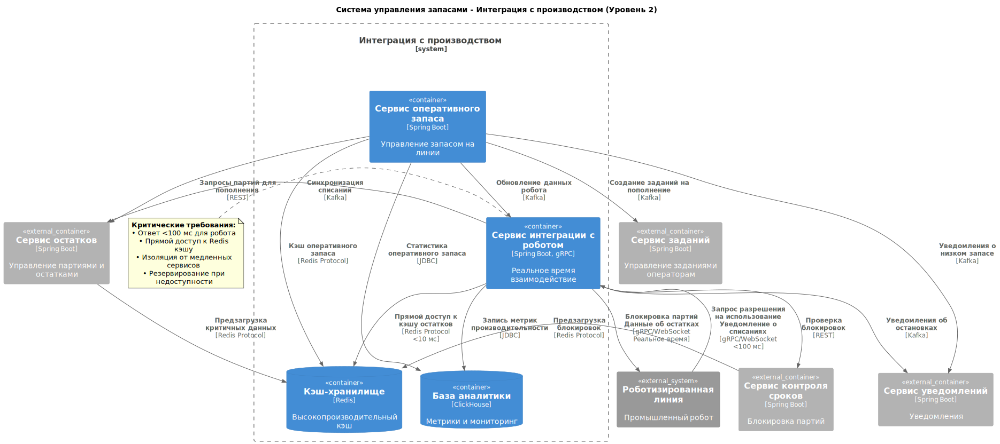
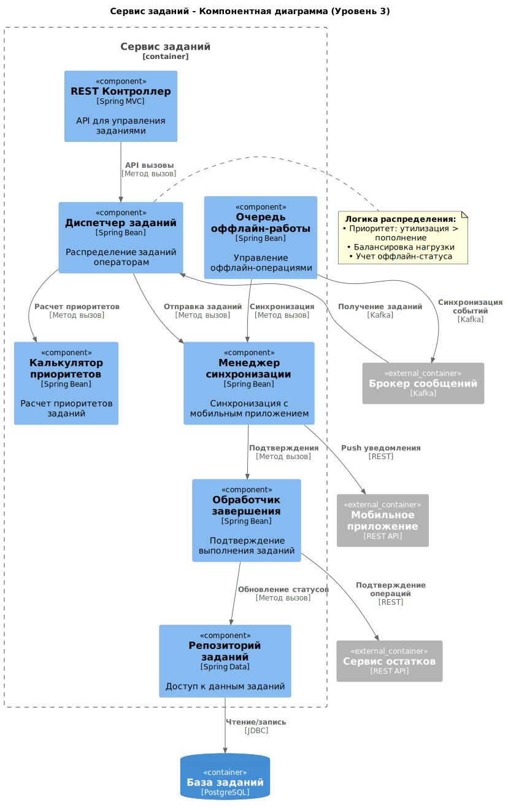

# Компонентная архитектура

## **Требования, обосновывающие выбор микросервисной архитектуры**

### **Масштабируемость до 100 ресторанов**

**Исходное требование (из контекста):**
> *"Если проект будет успешен, мы масштабируем нашу систему на все рестораны. Всего ресторанов около 100."*

**Обоснование для микросервисов:**

- **Независимое масштабирование:** Сервис автозаказа будет нагружен пропорционально количеству ресторанов, в то время как сервис управления справочниками - нет. Микросервисы позволяют масштабировать только нужные компоненты.
- **Географическое распределение:** Для сети ресторанов может потребоваться распределенное развертывание ближе к регионам.

### **Интеграция с разнородными внешними системами**

**Исходное требование (FR6.1, FR6.2):**

> **FR6.1:** Система должна предоставлять API для роботизированной линии...
> **FR6.2:** Система должна предоставлять API для обмена данными с системой Логистического Центра...

**Обоснование для микросервисов:**

- **Изоляция интеграций:** Каждая внешняя система (робот, ЛЦ) имеет свой протокол и SLA. Микросервисы позволяют изолировать проблемы интеграции.
- **Независимое развитие:** Изменения в API ЛЦ не должны затрагивать сервис работы с роботизированной линией.

### **Критичные требования к производительности и доступности**

**Исходное требование (NFR для UC11):**

> **NFR:** Время от момента отправки запроса роботом до получения ответа должно быть **минимальным (< 100 мс)**... **доступность 99.99%**.

**Обоснование для микросервисов:**

- **Выделение критичных компонентов:** Сервис проверки сроков годности требует максимальной производительности и может быть развернут на более мощном оборудовании.
- **Изоляция сбоев:** Проблемы в менее критичных сервисах (например, отчетности) не должны влиять на работу производственной линии.

### **Разные модели данных и паттерны доступа**

**Исходное требование (из анализа процессов):**
> *Операции с роботом требуют реального времени, формирование отчетов - пакетной обработки, работа с заказами - транзакционности.*

**Обоснование для микросервисов:**

- **Оптимизация БД:** Сервис работы с роботом может использовать in-memory БД, сервис отчетов - колоночную БД, сервис заказов - реляционную транзакционную БД.
- **Разные архитектурные паттерны:** CQRS для отчетов, Event Sourcing для аудита движений запасов.

### **Независимость жизненных циклов компонентов**

**Исходное требование (из этапов реализации):**
> *MVP включает базовый функционал, Релиз 1.0 добавляет интеграции и автоматизацию.*

**Обоснование для микросервисов:**

- **Независимые релизы:** Можно развивать и выпускать новые версии сервиса автозаказа, не затрагивая работающий сервис инвентаризации.
- **Поэтапное внедрение:** В MVP можно реализовать монолит, а в Релизе 1.0 выделить критические сервисы.

### **Разные команды разработки**

**Исходное требование (подразумеваемое):**
> *Разные экспертизы: интеграции с оборудованием, бизнес-логика заказов, аналитика и отчетность.*

**Обоснование для микросервисов:**

- **Независимые команды:** Команда интеграций может работать с API робота, команда аналитики - с системой отчетности.
- **Технологический стек:** Каждая команда может выбирать оптимальный стек технологий для своей предметной области.

## **Обоснование выбора архитектурного стиля**

Для MVP может быть целесообразно начать с модульного монолита, заложив границы будущих сервисов, и выделять микросервисы по мере роста нагрузки и команды.

## Диаграмма контекста

## Диаграммы контейнеров

Далее диаграмму разделил на две части, чтобы было удобнее описывать и все было хорошо видно. Некоторые сервисы повторяются на диаграммах и могут быть реализованы в одном экземпляре (на усмотрение разработчика).

### Часть сервисов по автозаказу и логистике

#### Описание контейнеров системы автозаказа и логистики

**Контейнеры системы автозаказа и логистики**

| Контейнер | Тип | Назначение | Технологии |
|-----------|-----|------------|------------|
| **Веб-приложение** | Фронтенд | Веб-приложение для управления заказами и правилами. Интерфейс для технолога для настройки правил автозаказа, корректировки заказов, управления справочниками. | React, TypeScript |
| **API Gateway** | Бэкэнд | Единая точка входа в систему. Обеспечивает маршрутизацию запросов, балансировку нагрузки, централизованную аутентификацию. | Spring Cloud Gateway |
| **Обнаружение сервисов** | Инфраструктура | Регистрация и обнаружение сервисов. Позволяет динамически находить доступные экземпляры сервисов в распределенной системе. | Netflix Eureka |
| **Сервис аутентификации** | Бэкэнд | Сервис аутентификации и авторизации. Управление пользователями, проверка прав доступа, генерация JWT токенов. | Spring Boot, JWT |
| **Сервис заказов** | Бэкэнд | Основной бизнес-сервис для автозаказа. Управление правилами пополнения, расчет заказов, ведение справочников номенклатуры, корректировка заказов. | Spring Boot |
| **Сервис интеграции с ЛЦ** | Бэкэнд | Сервис интеграции с логистическим центром. Обмен данными с поставщиком: передача заказов, получение информации о поставках и статусах заказов. | Spring Boot |
| **База заказов** | База данных | Хранение данных заказов и правил. Содержит информацию о заказах, правилах пополнения, справочниках номенклатуры. | PostgreSQL |
| **Кэш-хранилище** | База данных | Кэш-хранилище для сессий и временных данных. Используется для хранения сессий пользователей, токенов, кэширования часто запрашиваемых данных. | Redis |
| **Брокер сообщений** | Инфраструктура | Асинхронная коммуникация между сервисами. Обеспечивает надежную доставку событий, буферизацию сообщений, отказоустойчивость. | Apache Kafka |

**Внешние зависимости системы**

| Контейнер | Тип | Назначение | Технологии |
|-----------|-----|------------|------------|
| **Сервис инвентаризации** | Бекэнд (внешний) | Сервис инвентаризации из другой группы. Предоставляет данные о текущих остатках полуфабрикатов для расчета автозаказа. | Spring Boot |
| **Логистический центр** | Внешняя система | Логистический центр (поставщик). Внешняя система для приема заказов и предоставления информации о поставках. | REST API |

**Ключевые технологические решения:**

1. **Spring Cloud Gateway** - для API Gateway вместо Nginx, лучшая интеграция с экосистемой Spring
2. **Netflix Eureka** - стандартное решение для обнаружения сервисов в Spring Cloud
3. **PostgreSQL** - надежная реляционная БД для транзакционных данных заказов
4. **Redis** - высокопроизводительный кэш для сессий и временных данных
5. **Apache Kafka** - брокер сообщений для асинхронной коммуникации
6. **React + TypeScript** - современный Фронтэнд стек для веб-приложения

### Часть сервисов по инвентаризации, контролю срока годности и пополнению оперативного запаса 

#### Описание контейнеров системы инвентаризации и производства

**Контейнеры системы инвентаризации и производства**

| Контейнер | Тип | Назначение | Технологии |
|-----------|-----|------------|------------|
| **Мобильное приложение** | Фронтэнд | Мобильное приложение для оператора линии. Используется для проведения инвентаризации, утилизации партий, пополнения запаса у роботов. | React Native |
| **API Gateway** | Бэкэнд | Единая точка входа в систему. Маршрутизация запросов, балансировка нагрузки, централизованная аутентификация для мобильных запросов. | Spring Cloud Gateway |
| **Обнаружение сервисов** | Инфраструктура | Регистрация и обнаружение сервисов. Динамическое обнаружение доступных экземпляров сервисов в распределенной системе. | Netflix Eureka |
| **Сервис аутентификации** | Бэкэнд | Сервис аутентификации и авторизации. Управление доступом операторов, генерация и валидация JWT токенов. | Spring Boot, JWT |
| **Сервис инвентаризации** | Бэкэнд | Основной бизнес-сервис инвентаризации. Управление пополнением запаса роботов, контроль остатков, отслеживание сроков годности, проведение инвентаризаций. | Spring Boot |
| **Сервис интеграции с роботом** | Бэкэнд | Сервис интеграции с роботизированной линией. Высокопроизводительное взаимодействие в реальном времени: проверка сроков, получение запросов на пополнение запаса. | Spring Boot, gRPC |
| **Сервис отчетности** | Бэкэнд | Сервис отчетности и аналитики. Формирование отчетов по срокам годности, остаткам, движениям запасов. | Spring Boot |
| **База инвентаризации** | База данных | Хранение операционных данных инвентаризации. Содержит информацию о партиях, остатках, сроках годности, движениях запасов. | PostgreSQL |
| **База отчетности** | База данных | Хранение аналитических данных для отчетности. Оптимизирована для сложных аналитических запросов и агрегаций. | ClickHouse |
| **Кэш-хранилище** | База данных | Высокопроизводительный кэш для критичных операций. Используется для мгновенного доступа к данным для робота и кэширования статусов. | Redis |
| **Брокер сообщений** | Инфраструктура | Асинхронная коммуникация между сервисами. Обеспечивает надежную доставку событий изменений и блокировок. | Apache Kafka |

**Внешние зависимости системы**

| Контейнер | Тип | Назначение | Технологии |
|-----------|-----|------------|------------|
| **Сервис заказов** | Бэкэнд (внешний) | Сервис заказов из другой группы. Получает данные об остатках для расчета автозаказа через асинхронные события. | Spring Boot |
| **Роботизированная линия** | Внешняя система | Роботизированная линия производства. Внешняя система для реального времени взаимодействия: запросы на проверку сроков, уведомления о пополнении запаса. | gRPC/WebSocket |

**Ключевые технологические решения для высокопроизводительных операций:**

1. **React Native** - кроссплатформенное мобильное приложение для операторов
2. **gRPC** - высокопроизводительный протокол для взаимодействия с роботом (вместо REST)
3. **Redis** - кэширование для обеспечения времени ответа <100 мс для робота
4. **ClickHouse** - колоночная БД для аналитических отчетов и агрегаций
5. **Apache Kafka** - надежная доставка событий для реального времени реакций
6. **PostgreSQL** - транзакционная БД для операционных данных инвентаризации

**Критические требования, обеспечиваемые архитектурой:**

- **Производительность** - gRPC + Redis для гарантии <100 мс ответов роботу
- **Надежность** - Kafka для гарантированной доставки событий блокировок
- **Масштабируемость** - независимое масштабирование сервисов через Обнаружение сервисов
- **Отказоустойчивость** - кэширование критичных данных в Redis
- **Аналитика в реальном времени** - ClickHouse для быстрой генерации отчетов

## Диаграммы компонентов

На диаграммах компонентов описаны основные сервисы, предоставляющие функционал системы.

### Сервис заказов

#### Описание компонентов сервиса заказов

**Компоненты сервиса заказов**

| Компонент | Уровень | Назначение | Технологии |
|-----------|---------|------------|------------|
| **Контроллер заказов** | API | REST API для управления заказами. Обрабатывает HTTP запросы на создание, редактирование, просмотр заказов. | Spring REST Controller |
| **Контроллер правил** | API | REST API для управления правилами автозаказа. Обеспечивает CRUD операции для бизнес-правил пополнения запасов. | Spring REST Controller |
| **Контроллер справочников** | API | REST API для работы со справочниками. Управление номенклатурой, категориями товаров, единицами измерения. | Spring REST Controller |
| **Сервис управления заказами** | Бизнес-логика | Логика работы с заказами. Обработка бизнес-процессов создания, корректировки, утверждения заказов. | Spring Service |
| **Сервис автозаказа** | Бизнес-логика | Логика автозаказа и расчета. Оркестрация процесса автоматического расчета заказов на основе правил и остатков. | Spring Service |
| **Сервис управления правилами** | Бизнес-логика | Управление правилами пополнения. Валидация, применение бизнес-правил для расчета точек заказа. | Spring Service |
| **Сервис справочников** | Бизнес-логика | Управление справочниками. Бизнес-логика работы с номенклатурой, категориями, единицами измерения. | Spring Service |
| **Блок расчета** | Механизм расчетов | Расчет заказа на основе правил. Математические вычисления для определения оптимального количества заказа. | Spring Component |
| **Блок бизнес-правил** | Механизм расчетов | Выполнение бизнес-правил. Движок для обработки сложных бизнес-правил автозаказа. | Drools Engine |
| **Механизм доступа к данным заказов** | Доступ к данным | Доступ к данным заказов. Абстракция для работы с таблицами заказов в базе данных. | Spring Data JPA |
| **Механизм доступа к данным бизнес-правил** | Доступ к данным | Доступ к правилам пополнения. Абстракция для работы с таблицами бизнес-правил. | Spring Data JPA |
| **Механизм доступа к данным справочников** | Доступ к данным | Доступ к справочнику товаров. Абстракция для работы с таблицами номенклатуры и категорий. | Spring Data JPA |
| **Клиент инвентаризации** | Интеграция | REST клиент для сервиса инвентаризации. Обеспечивает коммуникацию с сервисом остатков для получения текущих данных. | Feign Client |
| **Клиент логистики** | Интеграция | REST клиент для сервиса интеграции с ЛЦ. Обеспечивает передачу заказов в логистический центр. | Feign Client |
| **Поставщик событий о заказах** | Синхронизация | Публикация событий заказов. Генерирует и отправляет события о изменениях в заказах для других сервисов. | Spring Kafka |

**Внешние зависимости сервиса**

| Компонент | Тип | Назначение | Технологии |
|-----------|-----|------------|------------|
| **База заказов** | База данных | Хранение данных заказов и правил. Основное хранилище для всей информации о заказах, правилах, справочниках. | PostgreSQL |
| **Сервис инвентаризации** | Внешний сервис | Предоставляет данные об остатках. Внешний сервис для получения актуальной информации о текущих запасах. | Spring Boot |
| **Сервис интеграции с ЛЦ** | Внешний сервис | Обеспечивает коммуникацию с логистическим центром. Внешний сервис для передачи заказов поставщику. | Spring Boot |
| **Брокер сообщений** | Инфраструктура | Асинхронная коммуникация между сервисами. Обеспечивает доставку событий о заказах другим системам. | Apache Kafka |

### Сервис интеграции с ЛЦ

#### Описание компонентов сервиса интеграции с ЛЦ

**Компоненты сервиса интеграции с ЛЦ**

| Компонент | Уровень | Назначение | Технологии |
|-----------|---------|------------|------------|
| **Контроллер логистики** | API | REST API для внутренних сервисов. Принимает запросы от сервиса заказов на передачу заказов в ЛЦ и предоставляет статусы поставок. | Spring REST Controller |
| **Сервис синхронизации** | Бизнес-логика | Синхронизация заказов с ЛЦ. Управляет процессом отправки заказов поставщику, обработкой подтверждений, повторными попытками при ошибках. | Spring Service |
| **Сервис отслеживания** | Бизнес-логика | Отслеживание поставок. Мониторинг статусов заказов в ЛЦ, получение уведомлений о готовности поставок, обновление статусов в системе. | Spring Service |
| **Сервис данных от поставщика** | Бизнес-логика | Обработка данных от поставщика. Валидация и преобразование данных, полученных от логистического центра, в формат системы. | Spring Service |
| **REST клиент поставщика** | Внешняя интеграция | REST клиент для API ЛЦ. Обеспечивает взаимодействие с REST API логистического центра для отправки заказов и получения данных. | RestTemplate |
| **SOAP клиент поставщика** | Внешняя интеграция | SOAP клиент для API ЛЦ. Обеспечивает взаимодействие с SOAP API логистического центра для сложных интеграционных сценариев. | SOAP Client |
| **API адаптер** | Внешняя интеграция | Адаптер различных API поставщика. Унифицирует взаимодействие с разными протоколами и версиями API логистического центра. | Spring Component |
| **Преобразование заказа** | Обработка данных | Преобразование форматов заказов. Конвертирует внутренний формат заказов системы в формат, ожидаемый API логистического центра. | Spring Component |
| **Преобразование доставки** | Обработка данных | Преобразование данных поставок. Конвертирует данные о поставках из формата ЛЦ во внутренний формат системы. | Spring Component |
| **Обработчик ошибок** | Обработка данных | Обработка ошибок интеграции. Управление исключениями, повторные попытки отправки, логирование ошибок взаимодействия с ЛЦ. | Spring Component |
| **Сервис доступа к данным заказов** | Доступ к данным | Доступ к данным заказов поставщика. Управление хранением информации о заказах, переданных в логистический центр. | Spring Data JPA |
| **Сервис доступа к данным поставок** | Доступ к данным | Доступ к данным поставок. Управление хранением информации о статусах поставок, датах доставки, количестве полученного товара. | Spring Data JPA |

**Внешние зависимости сервиса**

| Компонент | Тип | Назначение | Технологии |
|-----------|-----|------------|------------|
| **База заказов** | База данных | Хранение данных заказов и поставок. Основное хранилище для информации о заказах в ЛЦ, статусах поставок, истории взаимодействий. | PostgreSQL |
| **Сервис заказов** | Внешний сервис | Источник заказов для передачи в ЛЦ. Внешний сервис, который инициирует процесс передачи заказов поставщику. | Spring Boot |
| **Логистический центр** | Внешний сервис | Внешняя система поставщика. Принимает заказы и предоставляет информацию о статусах поставок через REST/SOAP API. | REST/SOAP API |

### Сервис отчетности

#### Описание компонентов сервиса отчетности

**Компоненты сервиса отчетности**

| Компонент | Уровень | Назначение | Технологии |
|-----------|---------|------------|------------|
| **Контроллер отчетов** | API | REST API для генерации отчетов. Принимает HTTP запросы на создание различных типов отчетов, управляет параметрами отчетов. | Spring REST Controller |
| **Сервис отчетов по срокам** | Бизнес-логика | Генерация отчетов по истекающим срокам. Формирование отчетов о партиях с истекающими сроками годности, прогнозирование утилизаций. | Spring Service |
| **Сервис отчетов по остаткам** | Бизнес-логика | Генерация отчетов по текущим остаткам. Анализ текущих уровней запасов, выявление дефицита или излишков. | Spring Service |
| **Сервис отчетов по движениям** | Бизнес-логика | Генерация отчетов по движениям запасов. Анализ приходов, расходов, перемещений товаров за период. | Spring Service |
| **Генератор отчетов** | Генерация отчетов | Оркестрация процесса генерации отчетов. Управление потоком создания отчетов, координация работы специализированных сервисов. | Spring Service |
| **Агрегатор данных** | Генерация отчетов | Агрегация данных из нескольких источников. Объединение информации из разных систем для комплексной аналитики. | Spring Component |
| **Форматировщик отчетов** | Генерация отчетов | Форматирование отчетов в PDF/Excel. Преобразование данных в удобные для пользователя форматы вывода. | Spring Component |
| **Репозиторий отчетов** | Доступ к данным | Доступ к сохраненным отчетам. Управление историей сгенерированных отчетов, их хранением и поиском. | Spring Data JPA |
| **Репозиторий аналитики** | Доступ к данным | Доступ к аналитическим данным. Работа с агрегированными данными для быстрого формирования отчетов. | Spring Data JPA |
| **Консьюмер событий** | Обработка событий | Обработка событий для аналитики. Прием событий от других сервисов для обновления аналитических данных в реальном времени. | Spring Kafka |

**Внешние зависимости сервиса**

| Компонент | Тип | Назначение | Технологии |
|-----------|-----|------------|------------|
| **База отчетности** | База данных | Хранение аналитических данных. Специализированное хранилище для быстрой агрегации и анализа больших объемов данных. | ClickHouse |
| **Сервис инвентаризации** | Внешний сервис | Источник актуальных операционных данных. Предоставляет свежие данные об остатках, партиях, движениях для отчетности. | Spring Boot |
| **Брокер сообщений** | Инфраструктура | Асинхронная коммуникация между сервисами. Обеспечивает доставку событий для обновления аналитических данных. | Apache Kafka |

### Сервис инвентаризации

#### Описание компонентов сервиса инвентаризации

**Компоненты сервиса инвентаризации**

| Компонент | Уровень | Назначение | Технологии |
|-----------|---------|------------|------------|
| **Контроллер партий** | API | REST API для управления партиями. Обрабатывает операции создания, чтения, обновления партий товаров, управление статусами партий. | Spring REST Controller |
| **Контроллер инвентаризации** | API | REST API для проведения инвентаризаций. Управляет процессом инвентаризации: создание заданий, внесение результатов, расчет расхождений. | Spring REST Controller |
| **Контроллер сроков** | API | REST API для контроля сроков годности. Предоставляет интерфейс для работы со сроками годности партий, блокировок, утилизаций. | Spring REST Controller |
| **Сервис управления партиями** | Бизнес-логика | Логика работы с партиями товаров. Управление жизненным циклом партий: создание, перемещение, списание, блокировка. | Spring Service |
| **Сервис управления инвентаризацией** | Бизнес-логика | Логика проведения инвентаризаций. Оркестрация процесса подсчета остатков, сверки данных, формирования актов расхождений. | Spring Service |
| **Сервис управления сроками** | Бизнес-логика | Логика контроля сроков годности. Управление проверками сроков, автоматическая блокировка просроченных партий, уведомления. | Spring Service |
| **Сервис движений запасов** | Бизнес-логика | Логика перемещений и списаний. Обработка операций поступления, расхода, внутреннего перемещения товаров. | Spring Service |
| **Проверщик сроков** | Планировщики | Периодическая проверка сроков годности. Автоматический мониторинг партий на предмет истечения сроков годности по расписанию. | Scheduled Service |
| **Монитор остатков** | Планировщики | Мониторинг уровня запасов. Отслеживание критических уровней остатков, генерация предупреждений о необходимости пополнения. | Scheduled Service |
| **Репозиторий партий** | Доступ к данным | Доступ к данным партий. Абстракция для работы с таблицами партий, включая информацию о сроках годности и статусах. | Spring Data JPA |
| **Репозиторий инвентаризации** | Доступ к данным | Доступ к данным инвентаризаций. Управление хранением информации о проведенных инвентаризациях и их результатах. | Spring Data JPA |
| **Репозиторий движений** | Доступ к данным | Доступ к данным движений запасов. Работа с историей всех операций поступления, расхода и перемещения товаров. | Spring Data JPA |
| **Публикатор событий** | События | Публикация событий изменений. Генерация и отправка событий о изменениях в запасах для других сервисов системы. | Spring Kafka |
| **Сервис кэширования** | События | Управление кэшем остатков. Обеспечение быстрого доступа к актуальным данным об остатках через кэширование. | Spring Service |

**Внешние зависимости сервиса**

| Компонент | Тип | Назначение | Технологии |
|-----------|-----|------------|------------|
| **База инвентаризации** | База данных | Хранение операционных данных. Основное хранилище для информации о партиях, инвентаризациях, движениях запасов. | PostgreSQL |
| **Кэш-хранилище** | База данных | Высокопроизводительный кэш. Хранение часто запрашиваемых данных для обеспечения быстрого доступа. | Redis |
| **Сервис интеграции с роботом** | Внешний сервис | Потребитель данных о партиях. Запрашивает информацию о партиях для проверки сроков годности роботом. | Spring Boot |
| **Брокер сообщений** | Инфраструктура | Асинхронная коммуникация. Обеспечивает доставку событий о изменениях в запасах другим системам. | Apache Kafka |

### Сервис интеграции с роботом

#### Описание сервиса интеграции с роботом

**Компоненты сервиса интеграции с роботом**

| Компонент | Уровень | Назначение | Технологии |
|-----------|---------|------------|------------|
| **gRPC контроллер** | Протоколы | Обработка gRPC запросов от робота. Принимает высокочастотные запросы на проверку сроков годности и управление запасами в реальном времени. | gRPC Service |
| **REST контроллер** | Протоколы | REST API для внутренних сервисов. Обеспечивает взаимодействие с другими сервисами системы для обмена данными о пополнении запасов. | Spring REST Controller |
| **Сервис проверки сроков** | Бизнес-логика | Проверка сроков годности для робота. Обрабатывает запросы на валидацию сроков годности партий перед их использованием в производстве. | Spring Service |
| **Сервис команд роботу** | Бизнес-логика | Управление командами для робота. Формирование и отправка команд роботизированной линии: блокировка использования, уведомления о статусах. | Spring Service |
| **Сервис пополнения запасов** | Бизнес-логика | Логика пополнения оперативного запаса. Управление процессом пополнения запасов на линии на основе запросов от робота. | Spring Service |
| **Сервис кэширования** | Высокопроизводительный доступ | Высокопроизводительный доступ к данным. Обеспечение мгновенного доступа к критичным данным через многоуровневое кэширование. | Spring Service |
| **Сервис реального времени** | Высокопроизводительный доступ | Обработка данных в реальном времени. Оптимизированная обработка запросов с гарантией времени ответа <100 мс. | Spring Service |
| **gRPC клиент** | Интеграция | Клиент для связи с роботом. Обеспечивает исходящую коммуникацию с роботизированной линией для отправки команд и уведомлений. | gRPC Stub |
| **Адаптер протоколов** | Интеграция | Адаптация различных протоколов связи. Унификация взаимодействия с разными версиями протоколов робота (gRPC, WebSocket). | Spring Component |
| **Потребитель событий** | Обработка событий | Обработка событий от других сервисов. Прием и обработка асинхронных событий о блокировках партий и изменениях запасов. | Spring Kafka |

**Внешние зависимости сервиса**

| Компонент | Тип | Назначение | Технологии |
|-----------|-----|------------|------------|
| **Кэш-хранилище** | База данных | Высокопроизводительный кэш. Хранение часто запрашиваемых данных о статусах партий и остатках для мгновенного доступа. | Redis |
| **Сервис инвентаризации** | Внешний сервис | Источник данных о партиях. Предоставляет актуальную информацию о партиях, сроках годности и остатках при отсутствии данных в кэше. | Spring Boot |
| **Роботизированная линия** | Внешняя система | Промышленный робот. Внешняя система, отправляющая запросы на проверку сроков и получающая команды управления. | gRPC |
| **Брокер сообщений** | Инфраструктура | Асинхронная коммуникация. Обеспечивает доставку событий от других сервисов для реактивного управления роботом. | Apache Kafka |
