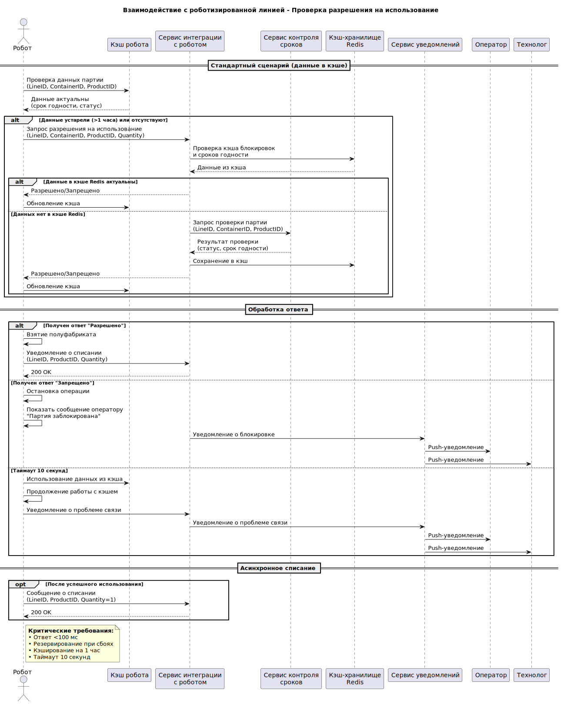
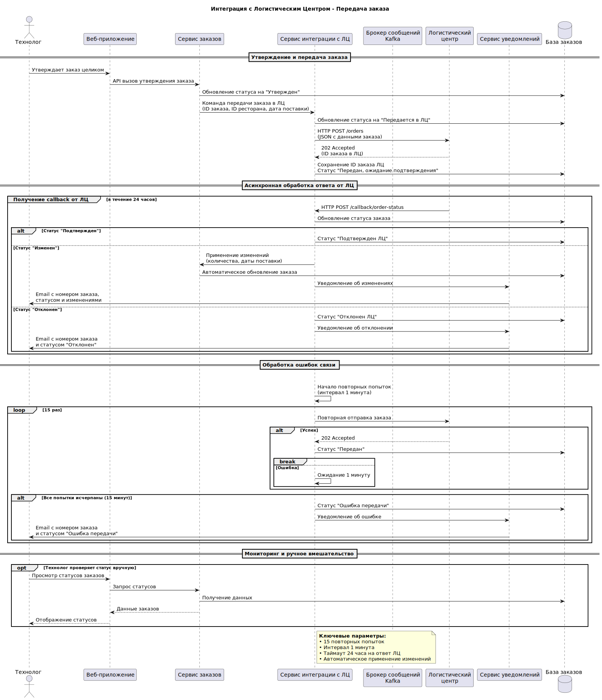
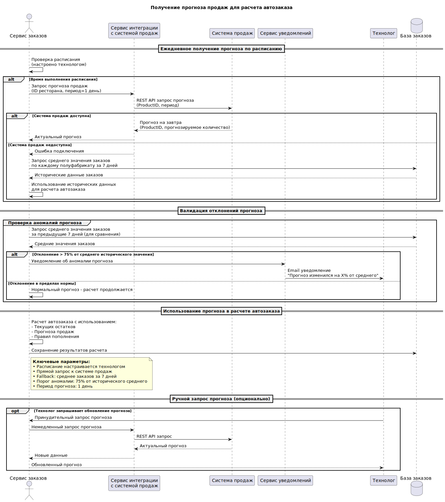
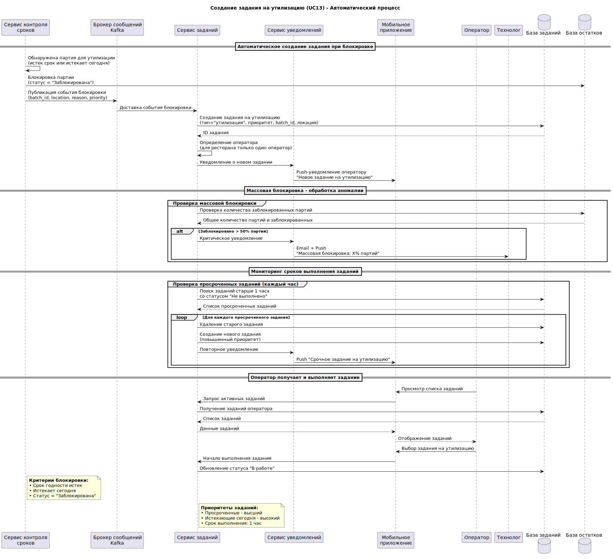
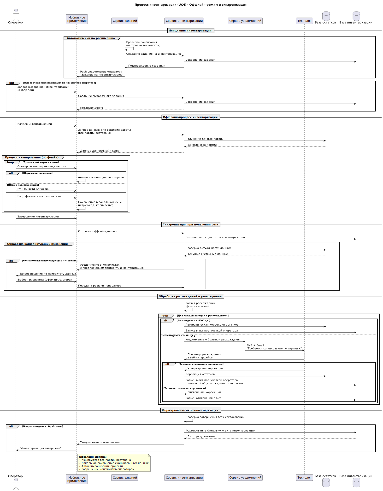

# Интеграционное взаимодействие

Описаны взаимодействия с системой роботизированной линии и с логистическим центром.

## Диаграммы последовательности взаимодействия с системой роботизированной линии.

Получение разрешения при списании полуфабриката из оперативного запаса.

## Диаграмма последовательности взаимодействия с логистическим центром

## Диаграмма последовательности получения прогноза продаж для расчета автозаказа полуфабрикатов

## Диаграмма последовательности создания задания на утилизацию

## Диаграмма последовательности инвентаризации в офф-лайн режиме и синхронизация

