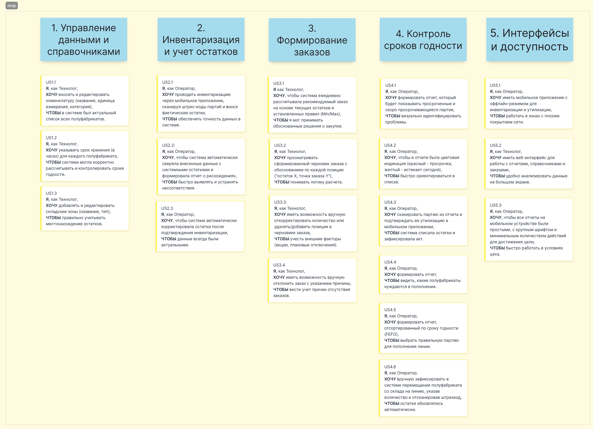
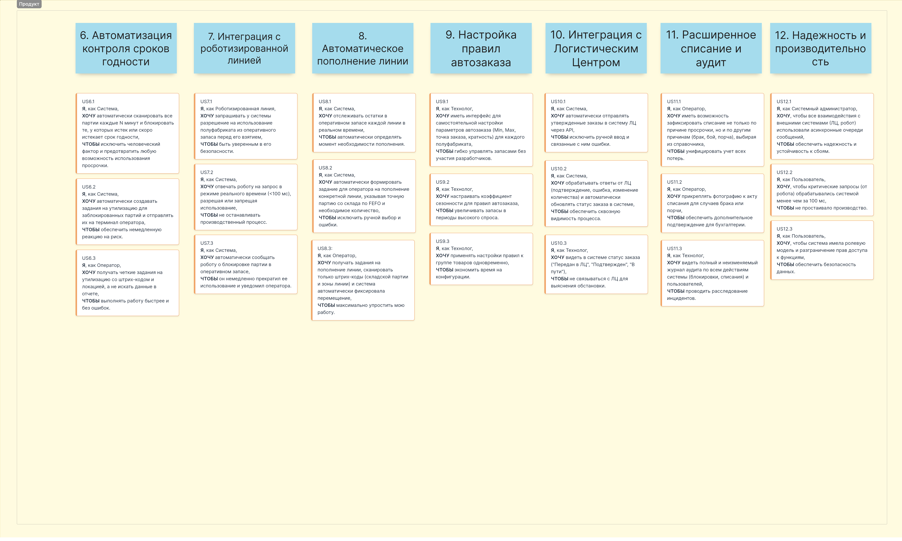

# Пользовательские истории (User Story) и порядок их реализации

## Карта пользовательских историй, реализуемых в рамках MVP

доступна по [ссылке](https://app.holst.so/share/b/7519e7e3-06ec-47d5-a09a-acd380b08a67)

### Описание User Story, реализуемых в рамках MVP

**Эпик: Управление данными и справочниками**

*   **US1.1:** **Я**, как Технолог, **хочу** вносить и редактировать номенклатуру (название, единица измерения, категория), **чтобы** в системе был актуальный список всех полуфабрикатов.
*   **US1.2:** **Я**, как Технолог, **хочу** указывать срок хранения (в часах) для каждого полуфабриката, **чтобы** система могла корректно рассчитывать и контролировать сроки годности.
*   **US1.3:** **Я**, как Технолог, **хочу** добавлять и редактировать складские зоны (название, тип), **чтобы** правильно учитывать местонахождение остатков.

**Эпик: Инвентаризация и учет остатков**

*   **US2.1:** **Я**,Как Оператор, **хочу** проводить инвентаризацию через мобильное приложение, сканируя штрих-коды партий и внося фактические остатки, **чтобы** обеспечить точность данных в системе.
*   **US2.2:** **Я**, как Оператор, **хочу**, чтобы система автоматически сверяла внесенные данные с системными остатками и формировала отчет о расхождениях, **чтобы** быстро выявлять и устранять несоответствия.
*   **US2.3:** Как Оператор, я хочу, чтобы система автоматически корректировала остатки после подтверждения инвентаризации, чтобы данные всегда были актуальными.

**Эпик: Формирование заказов (Рекомендательная система)**

*   **US3.1:** **Я**, как Технолог, **хочу**, чтобы система ежедневно рассчитывала рекомендуемый заказ на основе текущих остатков и установленных правил (Min/Max), **чтобы** я мог принимать обоснованные решения о закупке.
*   **US3.2:** **Я**, как Технолог, **хочу** просматривать сформированный черновик заказа с обоснованием по каждой позиции ("остаток X, точка заказа Y"), **чтобы** понимать логику расчета.
*   **US3.3:** **Я**, как Технолог, **хочу** иметь возможность вручную откорректировать количество или удалить/добавить позиции в черновике заказа, **чтобы** учесть внешние факторы (акции, плановые отключения).
*   **US3.4:** **Я**, как Технолог, **хочу** иметь возможность вручную отклонить заказ с указанием причины (например, "закрыто на мойку"), **чтобы** вести учет причин отсутствия заказов.

**Эпик: Контроль сроков годности (Отчетность и ручные действия)**

*   **US4.1:** **Я**, как Оператор, **хочу** формировать отчет, который будет показывать просроченные и скоро просрочивающиеся партии, **чтобы** визуально идентифицировать проблемы.
*   **US4.2:** **Я**, как Оператор, **хочу**, чтобы в отчете была цветовая индикация (красный - просрочка, желтый - истекает сегодня), **чтобы** быстро ориентироваться в списке.
*   **US4.3:** **Я**, как Оператор, **хочу** сканировать партию из отчета и подтверждать ее утилизацию в мобильном приложении, **чтобы** система списала остатки и зафиксировала акт.
*   **US4.4:** **Я**, как Оператор, **хочу** формировать отчет, **чтобы** видеть, какие полуфабрикаты нуждаются в пополнении.
*   **US4.5:** **Я**, как Оператор, **хочу** формировать отчет, отсортированный по сроку годности (FEFO), **чтобы** выбрать правильную партию для пополнения линии.
*   **US4.6:** **Я**, как Оператор, **хочу** вручную зафиксировать в системе перемещение полуфабриката со склада на линию, указав количество и отсканировав штрихкод, **чтобы** остатки обновлялись автоматически.

**Эпик: Интерфейсы и доступность**

*   **US5.1:** **Я**, как Оператор, **хочу** иметь мобильное приложение с оффлайн-режимом для инвентаризации и утилизации, **чтобы** работать в зонах с плохим покрытием сети.
*   **US5.2:** **Я**, как Технолог, **хочу** иметь веб-интерфейс для работы с отчетами, справочниками и заказами, **чтобы** удобно анализировать данные на большом экране.
*   **US5.3:** **Я**, как Оператор, **хочу**, чтобы все отчеты на мобильном устройстве были простыми, с крупным шрифтом и минимальным количеством действий для достижения цели, **чтобы** быстро работать в условиях цеха.

## Карта пользовательских историй, реализуемых в рамках первого релиза

доступна по [ссылке](https://app.holst.so/share/b/7519e7e3-06ec-47d5-a09a-acd380b08a67)

### Описание User Story, реализуемых в рамках первого релиза

**Эпик: Автоматизация контроля сроков годности**

*   **US6.1:** **Я**, как Система, **хочу** автоматически сканировать все партии каждые N минут и блокировать те, у которых истек или скоро истекает срок годности, **чтобы** исключить человеческий фактор и предотвратить любую возможность использования просрочки.
*   **US6.2:** **Я**, как Система, **хочу** автоматически создавать задания на утилизацию для заблокированных партий и отправлять их на терминал оператора, **чтобы** обеспечить немедленную реакцию на риск.
*   **US6.3:** **Я**, как Оператор, **хочу** получать четкие задания на утилизацию со штрихкодом и локацией, а не искать данные в отчете, **чтобы** выполнять работу быстрее и без ошибок.

**Эпик: Интеграция с роботизированной линией (Безопасность пищи)**

*   **US7.1:** **Я**, как Роботизированная линия, **хочу** запрашивать у системы разрешение на использование полуфабриката из оперативного запаса перед его взятием, **чтобы** быть уверенным в его безопасности.
*   **US7.2:** **Я**, как Система, **хочу** отвечать роботу на запрос в режиме реального времени (<100 мс), разрешая или запрещая использование, **чтобы** не останавливать производственный процесс.
*   **US7.3:** **Я**, как Система, **хочу** автоматически сообщать роботу о блокировке партии в оперативном запасе, **чтобы** он немедленно прекратил ее использование и уведомил оператора.

**Эпик: Автоматическое пополнение линии**

*   **US8.1:** **Я**, как Система, **хочу** отслеживать остатки в оперативном запасе каждой линии в реальном времени, **чтобы** автоматически определять момент необходимости пополнения.
*   **US8.2:** **Я**, как Система, **хочу** автоматически формировать задание для оператора на пополнение конкретной линии, указывая точную партию со склада по FEFO и необходимое количество, **чтобы** исключить ручной выбор и ошибки.
*   **US8.3:** **Я**, как Оператор, **хочу** получать задания на пополнение линии, сканировать только штрихкоды (складской партии и зоны линии) и система автоматически фиксировала перемещение, **чтобы** максимально упростить мою работу.

**Эпик: Настройка правил автозаказа**

*   **US9.1:** **Я**, как Технолог, **хочу** иметь интерфейс для самостоятельной настройки параметров автозаказа (Min, Max, точка заказа, кратность) для каждого полуфабриката, **чтобы** гибко управлять запасами без участия разработчиков.
*   **US9.2:** **Я**, как Технолог, **хочу** настраивать коэффициент сезонности для правил автозаказа, **чтобы** увеличивать запасы в периоды высокого спроса.
*   **US9.3:** **Я**, как Технолог, **хочу** применять настройки правил к группе товаров одновременно, **чтобы** экономить время на конфигурации.

**Эпик: Интеграция с Логистическим Центром (ЛЦ)**

*   **US10.1:** **Я**, как Система, **хочу** автоматически отправлять утвержденные заказы в систему ЛЦ через API, **чтобы** исключить ручной ввод и связанные с ним ошибки.
*   **US10.2:** **Я**, как Система, **хочу** обрабатывать ответы от ЛЦ (подтверждение, ошибка, изменение количества) и автоматически обновлять статус заказа в системе, **чтобы** обеспечить сквозную видимость процесса.
*   **US10.3:** **Я**, как Технолог, **хочу** видеть в системе статус заказа ("Передан в ЛЦ", "Подтвержден", "В пути"), **чтобы** не связываться с ЛЦ для выяснения обстановки.

**Эпик: Расширенное списание и аудит**

*   **US11.1:** **Я**, как Оператор, **хочу** иметь возможность зафиксировать списание не только по причине просрочки, но и по другим причинам (брак, бой, порча), выбирая из справочника, **чтобы** унифицировать учет всех потерь.
*
*   **US11.2:** **Я**, как Технолог, **хочу** видеть полный и неизменяемый журнал аудита по всем действиям системы (блокировки, списания) и пользователей, **чтобы** проводить расследование инцидентов.

**Эпик: Надежность и производительность**

*   **US12.1:** **Я**, как Системный администратор, **хочу**, чтобы все взаимодействия с внешними системами (ЛЦ, робот) использовали асинхронные очереди сообщений, **чтобы** обеспечить надежность и устойчивость к сбоям.
*   **US12.2:** **Я**, как Пользователь, **хочу**, чтобы критические запросы (от робота) обрабатывались системой менее чем за 100 мс, **чтобы** не простаивало производство.
*   **US12.3:** **Я**, как Пользователь, **хочу**, чтобы система имела ролевую модель и разграничение прав доступа к функциям, **чтобы** обеспечить безопасность данных.

