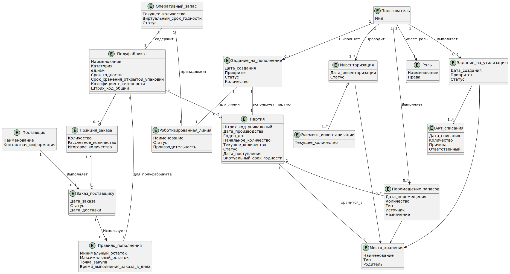

# Информационная модель

## Модель предметной области

## Модель данных

## Описание таблиц БД

### products (Номенклатура полуфабрикатов)

| Реквизит | Тип данных | Признак | Обязательность | Описание |
|----------|------------|---------|----------------|-----------|
| product_id | BIGINT | PK | Обязательно | Уникальный идентификатор полуфабриката |
| name | VARCHAR(255) |  | Обязательно | Наименование полуфабриката |
| category | VARCHAR(100) |  | Обязательно | Категория полуфабриката |
| unit_of_measure | VARCHAR(20) |  | Обязательно | Единица измерения (шт/кг) |
| shelf_life_hours | INTEGER |  | Обязательно | Общий срок хранения в часах |
| opened_package_shelf_life | INTEGER |  | Обязательно | Срок хранения открытой упаковки в часах |
| seasonality_coefficient | DECIMAL(5,2) |  | Опционально | Коэффициент сезонности для прогноза |
| barcode | VARCHAR(100) |  | Опционально | Штрих-код полуфабриката |

### batches (Партии полуфабрикатов)

| Реквизит | Тип данных | Признак | Обязательность | Описание |
|----------|------------|---------|----------------|-----------|
| batch_id | VARCHAR(100) | PK | Обязательно | Уникальный штрих-код партии |
| product_id | BIGINT | FK → products | Обязательно | Ссылка на полуфабрикат |
| location_id | BIGINT | FK → storage_locations | Обязательно | Место хранения партии |
| production_date | DATETIME |  | Обязательно | Дата производства |
| expiration_date | DATETIME |  | Обязательно | Срок годности |
| receipt_date | DATETIME |  | Обязательно | Дата поступления на склад |
| initial_quantity | DECIMAL(10,3) |  | Обязательно | Начальное количество |
| current_quantity | DECIMAL(10,3) |  | Обязательно | Текущее количество |
| status | VARCHAR(20) |  | Обязательно | Статус (активна/заблокирована/утилизирована) |
| supplier_name | VARCHAR(255) |  | Опционально | Наименование поставщика |
| virtual_expiration_date | DATETIME |  | Опционально | Виртуальный срок годности для оперативного запаса |

### storage_locations (Складские зоны)

| Реквизит | Тип данных | Признак | Обязательность | Описание |
|----------|------------|---------|----------------|-----------|
| location_id | BIGINT | PK | Обязательно | Уникальный идентификатор зоны |
| name | VARCHAR(255) |  | Обязательно | Наименование зоны |
| type | VARCHAR(50) |  | Обязательно | Тип зоны (холодильник/морозильник/оперативный запас) |
| parent_location_id | BIGINT | FK → storage_locations | Опционально | Родительская зона |
| barcode | VARCHAR(100) |  | Опционально | Штрих-код зоны для сканирования |

### inventory_counts (Инвентаризации)

| Реквизит | Тип данных | Признак | Обязательность | Описание |
|----------|------------|---------|----------------|-----------|
| count_id | BIGINT | PK | Обязательно | Уникальный идентификатор инвентаризации |
| user_id | BIGINT | FK → users | Обязательно | Ответственный пользователь |
| count_date | DATETIME |  | Обязательно | Дата проведения инвентаризации |
| status | VARCHAR(20) |  | Обязательно | Статус инвентаризации |

### inventory_count_items (Элементы инвентаризации)

| Реквизит | Тип данных | Признак | Обязательность | Описание |
|----------|------------|---------|----------------|-----------|
| item_id | BIGINT | PK | Обязательно | Уникальный идентификатор элемента |
| count_id | BIGINT | FK → inventory_counts | Обязательно | Ссылка на инвентаризацию |
| batch_id | VARCHAR(100) | FK → batches | Обязательно | Ссылка на партию |
| actual_quantity | DECIMAL(10,3) |  | Обязательно | Фактическое количество |
| system_quantity | DECIMAL(10,3) |  | Обязательно | Системное количество на момент инвентаризации |
| discrepancy | DECIMAL(10,3) |  | Обязательно | Расхождение (факт - система) |

### suppliers (Поставщики)

| Реквизит | Тип данных | Признак | Обязательность | Описание |
|----------|------------|---------|----------------|-----------|
| supplier_id | BIGINT | PK | Обязательно | Уникальный идентификатор поставщика |
| name | VARCHAR(255) |  | Обязательно | Наименование поставщика |
| contact_info | TEXT |  | Опционально | Контактная информация |

### purchase_orders (Заказы поставщикам)

| Реквизит | Тип данных | Признак | Обязательность | Описание |
|----------|------------|---------|----------------|-----------|
| order_id | BIGINT | PK | Обязательно | Уникальный идентификатор заказа |
| supplier_id | BIGINT | FK → suppliers | Обязательно | Поставщик |
| user_id | BIGINT | FK → users | Обязательно | Технолог, утвердивший заказ |
| order_date | DATETIME |  | Обязательно | Дата формирования заказа |
| status | VARCHAR(50) |  | Обязательно | Статус заказа |
| delivery_date | DATETIME |  | Опционально | Плановая дата поставки |

### order_items (Позиции заказа)

| Реквизит | Тип данных | Признак | Обязательность | Описание |
|----------|------------|---------|----------------|-----------|
| order_item_id | BIGINT | PK | Обязательно | Уникальный идентификатор позиции |
| order_id | BIGINT | FK → purchase_orders | Обязательно | Ссылка на заказ |
| product_id | BIGINT | FK → products | Обязательно | Полуфабрикат |
| quantity | DECIMAL(10,3) |  | Обязательно | Заказываемое количество |
| suggested_quantity | DECIMAL(10,3) |  | Обязательно | Рекомендуемое системой количество |
| final_quantity | DECIMAL(10,3) |  | Обязательно | Итоговое количество после корректировки |

### replenishment_rules (Правила пополнения)

| Реквизит | Тип данных | Признак | Обязательность | Описание |
|----------|------------|---------|----------------|-----------|
| rule_id | BIGINT | PK | Обязательно | Уникальный идентификатор правила |
| product_id | BIGINT | FK → products | Обязательно | Полуфабрикат |
| min_stock | DECIMAL(10,3) |  | Обязательно | Минимальный запас |
| max_stock | DECIMAL(10,3) |  | Обязательно | Максимальный запас |
| reorder_point | DECIMAL(10,3) |  | Обязательно | Точка заказа |
| lead_time_days | INTEGER |  | Обязательно | Время выполнения заказа в днях |
| min_order_quantity | DECIMAL(10,3) |  | Опционально | Минимальная партия заказа |
| order_multiple | DECIMAL(10,3) |  | Опционально | Кратность партии |

### disposal_tasks (Задания на утилизацию)

| Реквизит | Тип данных | Признак | Обязательность | Описание |
|----------|------------|---------|----------------|-----------|
| task_id | BIGINT | PK | Обязательно | Уникальный идентификатор задания |
| batch_id | VARCHAR(100) | FK → batches | Обязательно | Партия для утилизации |
| user_id | BIGINT | FK → users | Обязательно | Оператор, получивший задание |
| created_date | DATETIME |  | Обязательно | Дата создания задания |
| priority | VARCHAR(20) |  | Обязательно | Приоритет задания |
| status | VARCHAR(20) |  | Обязательно | Статус задания |

### disposal_acts (Акты списания)

| Реквизит | Тип данных | Признак | Обязательность | Описание |
|----------|------------|---------|----------------|-----------|
| act_id | BIGINT | PK | Обязательно | Уникальный идентификатор акта |
| task_id | BIGINT | FK → disposal_tasks | Обязательно | Ссылка на задание |
| responsible_user_id | BIGINT | FK → users | Обязательно | Ответственный за списание |
| disposal_date | DATETIME |  | Обязательно | Дата списания |
| quantity | DECIMAL(10,3) |  | Обязательно | Количество списания |
| reason | VARCHAR(100) |  | Обязательно | Причина списания |
| comment | TEXT |  | Опционально | Комментарий |

### stock_movements (Перемещения запасов)

| Реквизит | Тип данных | Признак | Обязательность | Описание |
|----------|------------|---------|----------------|-----------|
| movement_id | BIGINT | PK | Обязательно | Уникальный идентификатор перемещения |
| batch_id | VARCHAR(100) | FK → batches | Обязательно | Перемещаемая партия |
| from_location_id | BIGINT | FK → storage_locations | Опционально | Зона-источник |
| to_location_id | BIGINT | FK → storage_locations | Опционально | Зона-назначение |
| user_id | BIGINT | FK → users | Обязательно | Оператор, выполнивший перемещение |
| movement_date | DATETIME |  | Обязательно | Дата перемещения |
| quantity | DECIMAL(10,3) |  | Обязательно | Количество |
| movement_type | VARCHAR(20) |  | Обязательно | Тип перемещения |

### users (Пользователи)

| Реквизит | Тип данных | Признак | Обязательность | Описание |
|----------|------------|---------|----------------|-----------|
| user_id | BIGINT | PK | Обязательно | Уникальный идентификатор пользователя |
| name | VARCHAR(255) |  | Обязательно | ФИО пользователя |
| role_id | BIGINT | FK → roles | Обязательно | Роль пользователя |
| login | VARCHAR(100) |  | Обязательно | Логин для входа |
| password_hash | VARCHAR(255) |  | Обязательно | Хеш пароля |

### roles (Роли)

| Реквизит | Тип данных | Признак | Обязательность | Описание |
|----------|------------|---------|----------------|-----------|
| role_id | BIGINT | PK | Обязательно | Уникальный идентификатор роли |
| name | VARCHAR(50) |  | Обязательно | Наименование роли |
| permissions | JSON |  | Обязательно | Права доступа в формате JSON |

### operational_stock (Оперативный запас линии)

| Реквизит | Тип данных | Признак | Обязательность | Описание |
|----------|------------|---------|----------------|-----------|
| operational_id | BIGINT | PK | Обязательно | Уникальный идентификатор записи |
| line_id | BIGINT | FK → robotic_lines | Обязательно | Роботизированная линия |
| product_id | BIGINT | FK → products | Обязательно | Полуфабрикат |
| current_quantity | DECIMAL(10,3) |  | Обязательно | Текущее количество |
| virtual_expiration_date | DATETIME |  | Обязательно | Виртуальный срок годности |
| status | VARCHAR(20) |  | Обязательно | Статус |
| last_updated | DATETIME |  | Обязательно | Дата последнего обновления |

### robotic_lines (Роботизированные линии)

| Реквизит | Тип данных | Признак | Обязательность | Описание |
|----------|------------|---------|----------------|-----------|
| line_id | BIGINT | PK | Обязательно | Уникальный идентификатор линии |
| name | VARCHAR(255) |  | Обязательно | Наименование линии |
| status | VARCHAR(20) |  | Обязательно | Статус линии |
| capacity_per_day | INTEGER |  | Обязательно | Производительность (ед/день) |
| location | VARCHAR(100) |  | Опционально | Местоположение линии |

### replenishment_tasks (Задания на пополнение)

| Реквизит | Тип данных | Признак | Обязательность | Описание |
|----------|------------|---------|----------------|-----------|
| task_id | BIGINT | PK | Обязательно | Уникальный идентификатор задания |
| line_id | BIGINT | FK → robotic_lines | Обязательно | Линия для пополнения |
| batch_id | VARCHAR(100) | FK → batches | Обязательно | Партия для использования |
| user_id | BIGINT | FK → users | Обязательно | Оператор, получивший задание |
| created_date | DATETIME |  | Обязательно | Дата создания задания |
| priority | VARCHAR(20) |  | Обязательно | Приоритет задания |
| status | VARCHAR(20) |  | Обязательно | Статус задания |
| quantity | DECIMAL(10,3) |  | Обязательно | Количество для пополнения |