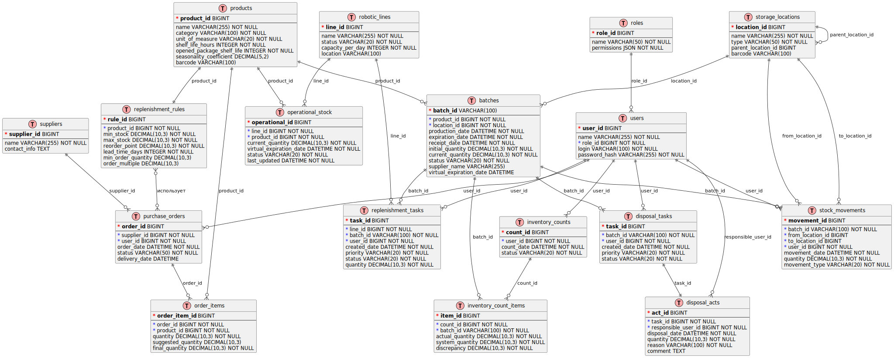

# Информационная модель

## Модель предметной области

## Модель данных

### Описание таблиц БД

Отлично! Выписываю полное описание всех таблиц физической модели данных.

#### **products (Полуфабрикаты)**

| Реквизит | Тип данных | Признак | Обязательность | Описание |
|----------|------------|---------|----------------|-----------|
| product_id | BIGINT | PK | NOT NULL | Уникальный идентификатор полуфабриката |
| name | VARCHAR(255) |  | NOT NULL | Наименование полуфабриката |
| category | VARCHAR(100) |  | NOT NULL | Категория |
| unit_of_measure | VARCHAR(20) |  | NOT NULL | Единица измерения |
| shelf_life_hours | INTEGER |  | NOT NULL | Срок хранения в часах |

#### **batches (Партии полуфабрикатов)**

| Реквизит | Тип данных | Признак | Обязательность | Описание |
|----------|------------|---------|----------------|-----------|
| batch_id | VARCHAR(100) | PK | NOT NULL | Штрихкод партии (уникальный идентификатор) |
| product_id | BIGINT | FK | NOT NULL | Ссылка на полуфабрикат |
| location_id | BIGINT | FK | NOT NULL | Текущее место хранения |
| production_date | DATETIME |  | NOT NULL | Дата производства |
| expiration_date | DATETIME |  | NOT NULL | Дата истечения срока годности |
| initial_quantity | DECIMAL(10,3) |  | NOT NULL | Первоначальное количество в партии |
| current_quantity | DECIMAL(10,3) |  | NOT NULL | Текущее остаток в партии |
| status | VARCHAR(20) |  | NOT NULL | Статус партии |
| supplier_name | VARCHAR(255) |  | NULL | Наименование поставщика партии |

#### **storage_locations (Места хранения)**

| Реквизит | Тип данных | Признак | Обязательность | Описание |
|----------|------------|---------|----------------|-----------|
| location_id | BIGINT | PK | NOT NULL | Уникальный идентификатор места хранения |
| name | VARCHAR(255) |  | NOT NULL | Наименование места |
| type | VARCHAR(50) |  | NOT NULL | Тип места |
| parent_location_id | BIGINT | FK | NULL | Родительское место хранения (для иерархии) |

#### **inventory_counts (Инвентаризация)**

| Реквизит | Тип данных | Признак | Обязательность | Описание |
|----------|------------|---------|----------------|-----------|
| count_id | BIGINT | PK | NOT NULL | Уникальный идентификатор инвентаризации |
| user_id | BIGINT | FK | NOT NULL | Пользователь, проводивший инвентаризацию |
| count_date | DATETIME |  | NOT NULL | Дата проведения инвентаризации |
| status | VARCHAR(20) |  | NOT NULL | Статус |

#### **inventory_count_items (Таблица Инвентаризации)**

| Реквизит | Тип данных | Признак | Обязательность | Описание |
|----------|------------|---------|----------------|-----------|
| item_id | BIGINT | PK | NOT NULL | Уникальный идентификатор элемента |
| count_id | BIGINT | FK | NOT NULL | Ссылка на инвентаризацию |
| batch_id | VARCHAR(100) | FK | NOT NULL | Ссылка на партию |
| actual_quantity | DECIMAL(10,3) |  | NOT NULL | Фактическое количество при подсчете |

#### **suppliers (Поставщики)**

Таблица справочника поставщиков (логистических центров)

| Реквизит | Тип данных | Признак | Обязательность | Описание |
|----------|------------|---------|----------------|-----------|
| supplier_id | BIGINT | PK | NOT NULL | Уникальный идентификатор поставщика |
| name | VARCHAR(255) |  | NOT NULL | Наименование поставщика |
| contact_info | TEXT |  | NULL | Контактная информация |

#### **purchase_orders (Заказ поставщику)**

| Реквизит | Тип данных | Признак | Обязательность | Описание |
|----------|------------|---------|----------------|-----------|
| order_id | BIGINT | PK | NOT NULL | Уникальный идентификатор заказа |
| supplier_id | BIGINT | FK | NOT NULL | Ссылка на поставщика |
| user_id | BIGINT | FK | NOT NULL | Пользователь, создавший заказ |
| order_date | DATETIME |  | NOT NULL | Дата создания заказа |
| status | VARCHAR(50) |  | NOT NULL | Статус |
| delivery_date | DATETIME |  | NULL | Плановая дата доставки |

#### **order_items (Таблица позиций заказа)**

| Реквизит | Тип данных | Признак | Обязательность | Описание |
|----------|------------|---------|----------------|-----------|
| order_item_id | BIGINT | PK | NOT NULL | Уникальный идентификатор позиции |
| order_id | BIGINT | FK | NOT NULL | Ссылка на заказ |
| product_id | BIGINT | FK | NOT NULL | Ссылка на полуфабрикат |
| quantity | DECIMAL(10,3) |  | NOT NULL | Заказываемое количество |
| suggested_quantity | DECIMAL(10,3) |  | NULL | Расчетное количество (рекомендация системы) |
| final_quantity | DECIMAL(10,3) |  | NOT NULL | Итоговое подтвержденное количество |

#### **replenishment_rules (Таблица правил пополнения запасов)**

| Реквизит | Тип данных | Признак | Обязательность | Описание |
|----------|------------|---------|----------------|-----------|
| rule_id | BIGINT | PK | NOT NULL | Уникальный идентификатор правила |
| product_id | BIGINT | FK | NOT NULL | Ссылка на полуфабрикат |
| min_stock | DECIMAL(10,3) |  | NOT NULL | Минимальный запас |
| max_stock | DECIMAL(10,3) |  | NOT NULL | Максимальный запас |
| reorder_point | DECIMAL(10,3) |  | NOT NULL | Точка заказа |
| lead_time_days | INTEGER |  | NOT NULL | Время выполнения заказа в днях |

#### **disposal_tasks (Задания на утилизацию)**

| Реквизит | Тип данных | Признак | Обязательность | Описание |
|----------|------------|---------|----------------|-----------|
| task_id | BIGINT | PK | NOT NULL | Уникальный идентификатор задания |
| batch_id | VARCHAR(100) | FK | NOT NULL | Ссылка на партию для утилизации |
| user_id | BIGINT | FK | NOT NULL | Пользователь, которому назначено задание |
| created_date | DATETIME |  | NOT NULL | Дата создания задания |
| priority | VARCHAR(20) |  | NOT NULL | Приоритет |
| status | VARCHAR(20) |  | NOT NULL | Статус |

#### **disposal_acts (Акты списания)**

| Реквизит | Тип данных | Признак | Обязательность | Описание |
|----------|------------|---------|----------------|-----------|
| act_id | BIGINT | PK | NOT NULL | Уникальный идентификатор акта |
| task_id | BIGINT | FK | NOT NULL | Ссылка на задание на утилизацию |
| disposal_date | DATETIME |  | NOT NULL | Дата списания |
| quantity | DECIMAL(10,3) |  | NOT NULL | Количество списанного |
| reason | VARCHAR(100) |  | NOT NULL | Причина списания |

#### **stock_movements (таблица движения запасов)**

| Реквизит | Тип данных | Признак | Обязательность | Описание |
|----------|------------|---------|----------------|-----------|
| movement_id | BIGINT | PK | NOT NULL | Уникальный идентификатор движения |
| batch_id | VARCHAR(100) | FK | NOT NULL | Ссылка на партию |
| from_location_id | BIGINT | FK | NULL | Откуда перемещается (NULL для прихода) |
| to_location_id | BIGINT | FK | NULL | Куда перемещается (NULL для расхода) |
| user_id | BIGINT | FK | NOT NULL | Пользователь, выполнивший перемещение |
| movement_date | DATETIME |  | NOT NULL | Дата перемещения |
| quantity | DECIMAL(10,3) |  | NOT NULL | Количество |
| movement_type | VARCHAR(20) |  | NOT NULL | Тип движения |

#### **users (Пользователи)**

| Реквизит | Тип данных | Признак | Обязательность | Описание |
|----------|------------|---------|----------------|-----------|
| user_id | BIGINT | PK | NOT NULL | Уникальный идентификатор пользователя |
| name | VARCHAR(255) |  | NOT NULL | Имя пользователя |
| role | VARCHAR(50) |  | NOT NULL | Роль |
| login | VARCHAR(100) |  | NOT NULL | Логин для входа |
| password_hash | VARCHAR(255) |  | NOT NULL | Хэш пароля |