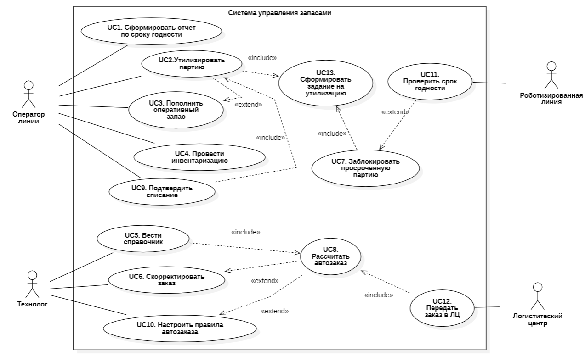
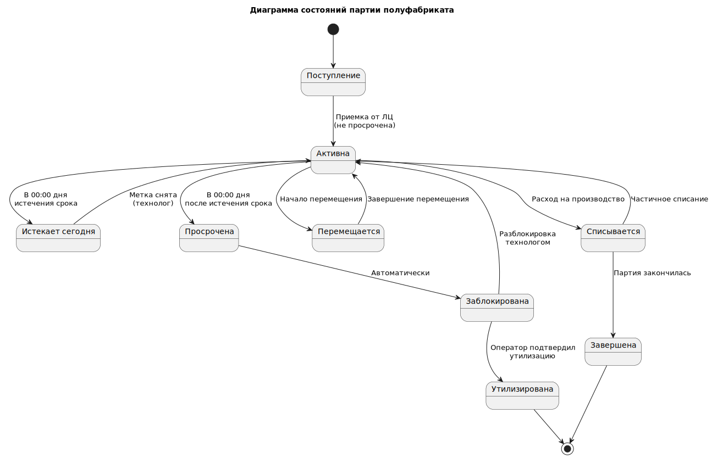

# Варианты использования и порядок их реализации

## Диаграмма вариантов использования

На снимке ниже представлены все варианты использования, которые будут реализованы в системе (нотация UML):

## Диаграмма статусов

Партии полуфабрикатов имеют статусы, показанные на снимке:

Реализацию вариантов использования необходимо разделить на два этапа - MVP и Первая поставка:

## Описание Use Case, реализуемых в рамках MVP

### UC1. Сформировать отчет по сроку годности

**1. Краткое описание:** Этот Use Case описывает процесс формирования пользователем (Оператором или Технологом) отчета, который отображает актуальные остатки полуфабрикатов с детализацией по партиям и их срокам годности. Отчет позволяет визуально идентифицировать партии, требующие внимания: с истекшим или близким к истечению сроком.

**2. Акторы:**

* **Основной:** Оператор роботизированной линии.
* **Основной:** Технолог.

**3. Предусловия:**

* Пользователь авторизован в системе.
* В системе проведена как минимум одна инвентаризация (UC4), обеспечивающая актуальность остатков.
* В системе внесены данные о сроках годности по партиям (через инвентаризацию).

**4.Триггер:**

* Пользователь выбирает опцию «Сформировать отчет по срокам годности».

**5. Основной поток событий:**

| Шаг | Действие Актора | Ответ Системы |
| :-- | :--- | :--- |
| 1 |  | Система отображает форму для настройки параметров отчета. |
| 2 | Пользователь задает **параметры отчета** (опционально):   - **Зона хранения**.  - **Группа товаров** .  - **Статус срока годности**.  - **Формат вывода**. | Система сохраняет предыдущие настройки пользователя по умолчанию. |
| 3 | Пользователь нажимает кнопку **"Сформировать"**. | |
| 4 | | Система выполняет запрос к базе данных, выбирая актуальные остатки по партиям, фильтруя и сортируя их согласно заданным параметрам. |
| 5 | | Система **формирует и отображает отчет** в виде таблицы. |
| 6 | Пользователь **анализирует отчет**. Он ищет партии с статусом **"Просрочен"** или **"Истекает сегодня"**. | |
| 7 | Пользователь **принимает решение** на основе отчета:   - Сообщает Технологу.  - Инициирует процесс утилизации (UC2-MVP).  - Переносит партию на более видное место для скорейшего использования (FIFO/FEFO). | |

**6. Альтернативные потоки:**

* **А1: Автоматическое формирование отчета по расписанию.**
  * Технолог может настроить автоматическую генерацию отчета (например, каждое утро в 7:00) и отправку его на email. В этом случае система является инициатором Use Case.
* **А2: Детализация партии.**
  * На шаге 5: Пользователь может кликнуть на строку с партией в отчете, чтобы просмотреть детальную информацию: дату поступления, первоначальное количество, историю движений.
* **А3: Печать отчета для бумажного аудита.**
  * Пользователь выбирает формат вывода "PDF", распечатывает отчет и подшивает его в журнал утилизаций.

**7. Постусловия:**

* Сформирован отчет, отвечающий заданным параметрам.
* Пользователь проинформирован о состоянии запасов и сроках годности.
* На основе отчета могут быть инициированы действия: утилизация, перемещение, заказ, пополнение роботизированной линии.

**8. Особые требования (NFR) для MVP:**

* **Производительность:** Формирование отчета на экран не должно занимать более **5-7 секунд**.
* **Удобство использования:** Это критичное требование для MVP. Отчет должен быть интуитивно понятным:
  * **Визуальная цветовая индикация:** Строки с просроченными партиями подсвечиваются **красным**, истекающие сегодня — **желтым**, истекающие завтра — **оранжевым**, партии со статусом "Заблокирована" — **серым**. Остальные — **белым/зеленым**.
  * **Сортировка по умолчанию:** Отчет автоматически сортируется по полю "Срок годности" (по возрастанию), чтобы самые проблемные партии были вверху.
  * **Важные колонки:** В отчете обязательно должны быть колонки: *Штрих-код, Наименование, Партия, Срок годности, Остаток, Локация, Статус*.
* **Доступность:** Отчет должен быть доступен для просмотра на веб-интерфейсе.
* **Консистентность:** Данные в отчете должны строго соответствовать данным на момент его формирования. Последующие изменения остатков не должны менять уже сформированный отчет (если он не сформирован заново).

### UC2-MVP. Утилизировать партию по отчету

**1. Краткое описание:** Этот Use Case описывает процесс, в котором Оператор линии вручную находит в системе партии, подлежащие утилизации (на основе отчета), физически изымает их и подтверждает факт утилизации в системе. Это упрощенная версия процесса без автоматических заданий для реализации на этапе MVP.

**2. Акторы:**

* **Основной:** Оператор линии.

**3. Предусловия:**

* Оператор авторизован в системе.
* В системе сформировать **отчет "По сроку годности"** (UC1).
* Оператор получил устное или письменное задание от Технолога на проведение утилизации.

**4. Триггер:**

* Оператор открывает отчет «По сроку годности».

**5 Основной поток событий:**

| Шаг | Действие Актора | Ответ Системы |
| :-- | :--- | :--- |
| 1 | | Система отображает список партий с истекшим или истекающим сроком годности. |
| 2 | Оператор просматривает отчет, определяет партию для утилизации и запоминает ее локацию и штрихкод. | |
| 3 | Оператор следует к указанной локации на складе, находит партию по штрих-коду. | |
| 4 | Оператор сканирует штрих-код партии с помощью мобильного устройства. | Система распознает партию, отображает ее данные и **подтверждает, что она находится в отчете "к утилизации"**. |
| 5 | Оператор физически изымает партию и перемещает ее в зону утилизации. | |
| 6 | Оператор в мобильном приложении нажимает кнопку **"Подтвердить утилизацию"**. | Система запрашивает подтверждение действия.|
| 7 | Оператор подтверждает свое намерение. | |
| 8 | | Система выполняет следующие действия:  1. **Списывает** остаток данной партии до нуля.  2. Изменяет статус партии на **"Утилизирована"** (снимая блокировку, если она была). 3. **Фиксирует** акт списания в базе данных с указанием причины "Утилизация по сроку годности", даты и ответственного.  4. **Обновляет** остатки на складе в реальном времени.  5. **Исключает** партию из отчета "к утилизации". |
| 9 | | Система отображает на терминале оператора сообщение об успехе. |

**6. Альтернативные потоки:**

* **А1: Партия не найдена в отчете.**
  * На шаге 4: Если оператор сканирует партию, которой нет в отчете, система показывает предупреждение: "Данная партия не значится в отчете к утилизации". Процесс утилизации прерывается и начинается шаг 2.
* **А2: Ручной ввод.**
  * На шаге 4: Если штрих-код поврежден, оператор может вручную найти партию в отчете и выбрать ее.

**7. Постусловия:**

* Партия физически утилизирована.
* Остатки партии в системе равны 0.
* В системе зафиксирован акт списания.
* Партия удалена из отчета "к утилизации".

**8. Особые требования (NFR) для MVP:**

* **Актуальность:** Отчет должен формироваться по требованию.
* **Доступность:** Оператор должен иметь быстрый доступ к отчету с web-приложения.

### UC3-MVP. Пополнить оперативный запас у робота по отчету

**1. Краткое описание:** Этот Use Case описывает процесс, в котором Оператор роботизированной линии вручную проверяет в системе отчет об остатках на линии, самостоятельно принимает решение о необходимости пополнения, находит на складе подходящую партию (руководствуясь принципом FEFO) и фиксирует факт перемещения в системе.

**2. Акторы:**

* **Основной:** Оператор линии.
* **Вторичный:** Технолог (может дать устное указание на пополнение).

**3. Предусловия:**

* Оператор авторизован в системе.
* В системе существует"Сроки годности" (UC1).

**4. Триггер:**

* Оператор визуально видит, что запас одного полуфабрикатов на производственной линии заканчивается.

**5. Основной поток событий:**

| Шаг | Действие Актора | Ответ Системы |
| :-- | :--- | :--- |
| 1 | Оператор открывает "Сроки годности" (UC1) для полуфабриката, который заканчивается.| |
| 2 | Оператор визуально определяет, что остаток одного из полуфабрикатов низкий. | |
| 3 | Оператор открывает **"Сроки годности" (UC1)** для этого полуфабриката. | Система показывает список всех партий этого полуфабриката на складе, отсортированный по сроку годности (FEFO). |
| 4 | Оператор **вручную выбирает партию** для пополнения из верхней строки отчета (с самым близким сроком годности) и запоминает ее локацию и штрихкод. | |
| 5 | Оператор следует к указанной **складской ячейке**, находит партию по штрих-коду. | |
| 6 | Оператор сканирует штрих-код партии на складе. | Система распознает партию и отображает ее данные. |
| 7 | Оператор забирает необходимое количество (например, целую упаковку) и транспортирует его к линии. | |
| 8 | Оператор физически пополняет **оперативный запас** линии. | |
| 9 | Оператор в мобильном приложении выбирает функцию **"Зафиксировать перемещение"**. | Система предлагает ввести количество (значение по умолчанию = 1). |
| 10 | Оператор при необходимости изменяет количество.| |
| 11 | Оператор нажимает **"Подтвердить"**. | Система выполняет проводку: списывает количество со складской партии и добавляет его к выбранному оперативному запасу. |
| 12 | | Система отображает сообщение об успешном перемещении. |

**6. Альтернативные потоки:**

* **А1: Партия не найдена или недостаточно.**
  * На шаге 5-6: Если выбранной партии нет на месте или ее недостаточно, оператор выбирает следующую в отчете партию по FEFO.
* **А2: Обнаружена просроченная партия.**
  * На шаге 6: При сканировании система может показать предупреждение, что срок годности партии истек. Оператор должен отказаться от ее использования и сообщить Технологу (инициируя процесс утилизации UC2-MVP).

**7. Постусловия:**

* Оперативный запас линии пополнен.
* Остатки на складе и на линии корректно обновлены в системе.
* В системе зафиксирован акт внутреннего перемещения.

**8. Особые требования (NFR) для MVP:**

* **Процесс вместо автоматизации:** Основная цель — не автоматизировать, а обеспечить пользователя всеми данными для принятия правильного решения и простым инструментом для фиксации результата.
* **Эффективность:** Процесс фиксации перемещения (шаги 9-12) должен быть максимально упрощен и занимать не более 15-20 секунд.

### UC4. Провести инвентаризацию

**1. Краткое описание:** Этот Use Case описывает процесс сверки фактического наличия полуфабрикатов на складе и в оперативном запасе роботизированной линии с данными в системе. Оператор проводит подсчет, вносит данные через мобильное приложение, а система фиксирует расхождения, автоматически корректирует остатки и формирует отчет.

**2. Акторы:**

* **Основной:** Оператор линии.
* **Второстепенный:** Система управления запасами (инициирует, обрабатывает данные).

**3. Предусловия:**

* Оператор авторизован в системе.
* Мобильное устройство оператора имеет соединение с системой (или может работать в автономном режиме).
* Движение партий на складе и на линии сведено к минимуму (инвентаризация проводится в нерабочие часы или в специально отведенное время).

**4. Триггер:**

* Система инициирует процесс по расписанию (ежедневно/еженедельно).

**5. Основной поток событий:**

| Шаг | Действие Актора | Ответ Системы |
| :-- | :--- | :--- |
| 1 | Оператор получает **задание "Провести инвентаризацию"** на своем мобильном устройстве. Задание содержит: тип инвентаризации (сплошная/выборочная), перечень зон (склад, линия) или номенклатуры. | **Триггер:** Система инициирует процесс по расписанию (ежедневно/еженедельно). |
| 2 | Оператор выбирает зону для начала подсчета. | Система отображает схему зоны и список номенклатуры с ожидаемыми остатками. |
| 3 | Оператор последовательно сканирует штрих-код каждой **партии** в зоне и вносит **фактическое количество/вес** в приложение. Для зоны **оперативного запаса** оператор сканирует штрих-код контейнера и вносит фактический остаток. | Система в режиме реального времени проверяет штрих-код на валидность и отображает название полуфабриката для подтверждения. |
| 4 | Оператор завершает обход всех указанных зон и в приложении нажимает **"Завершить инвентаризацию"**. | |
| 5 | | Система автоматически выполняет сверку: сравнивает внесенные фактические данные с системными остатками по каждой позиции. |
| 6 | | Система рассчитывает **расхождения** (излишки/недостачи) по каждой партии. |
| 7 | |Если расхождение ≤ порога → система автоматически корректирует остатки. Если расхождение > порога → система блокирует позицию для разбирательства и уведомляет Технолога. **Ключевой момент:** Корректировка остатков оперативного запаса на линии **не влияет на его виртуальный срок годности**, так как меняется только количество, а не состав партий. Система не позволяет корректировать остатки по партиям со статусом 'Заблокирована'.|
| 8 | | Система формирует **электронный акт инвентаризации** (отчет), в котором фиксируются: дата, время, зона, ответственный, все позиции с расхождениями и причина (если указана). |
| 9 | | Система помечает задание как "Выполнено". Акт инвентаризации сохраняется в базе данных и становится доступным Технологу. |

**6. Альтернативные потоки:**

* **А1: Обнаружена партия, не учтенная в системе.**
  * На шаге 3: Оператор может добавить новую позицию через "Добавить партию вручную", указав штрих-код, наименование и количество. Система зафиксирует это как **излишек**.
* **А2: Партия не имеет штрих-кода или он поврежден.**
  * На шаге 3: Оператор может найти полуфабрикат в списке номенклатуры вручную и внести данные.
* **А3: Инвентаризация прервана.**
  * На любом шаге: Оператор может приостановить задание. Система сохранит все внесенные данные. Позже оператор может возобновить инвентаризацию с момента останова.
* **А4: Значительное расхождение.**
  * На шаге 7: Если расхождение > порога, система блокирует позицию и уведомляет Технолога. Технолог подтверждает коррекцию в системе.

**7. Постусловия:**

* Фактические остатки полуфабрикатов на складе и на линии соответствуют данным в системе.
* Сформирован и сохранен акт инвентаризации.
* Все расхождения зафиксированы и учтены.
* Данные для автозаказа и контроля сроков годности актуализированы.

**8. Особые требования (NFR):**

* **Оффлайн-работа:** Мобильное приложение должно обеспечивать **полную оффлайн-функциональность**. Все данные должны кэшироваться на устройстве, а после восстановления связи — автоматически синхронизироваться.
* **Производительность:** Внесение данных по одной партии (сканирование + ввод количества) должно занимать у оператора не более 3-5 секунд.
* **Точность:** Алгоритм сверки и корректировки остатков должен быть атомарным и гарантировать, что данные не будут потеряны даже при сбое.
* **Удобство использования:** Интерфейс должен быть оптимизирован для быстрого последовательного сканирования: после внесения одного значения фокус автоматически переходит на поле для сканирования следующего штрих-кода.

### UC5. Вести справочники

**1. Краткое описание:** Этот Use Case описывает процесс создания, редактирования основных данных системы: справочника полуфабрикатов (номенклатуры) с установкой для каждого индивидуальных сроков хранения и справочника складских зон.

**2. Акторы:**

* **Основной:** Технолог.
* **Второстепенный:** Система управления запасами.

**3. Предусловия:**

* Пользователь (Технолог) авторизован в системе и имеет **административные права** на редактирование справочников.
* Пользователь работает с веб-интерфейсом.

**4. Триггер**

* Технологу необходимо занести данные в систему.

**5. Основной поток событий:**

| Шаг | Действие Актора | Ответ Системы |
| :-- | :--- | :--- |
| 1 | Технолог в основном меню системы выбирает раздел **"Справочники"** и подраздел **"Номенклатура"**. | Система отображает список всех существующих полуфабрикатов с возможностью сортировки и поиска. |
| 2 | Технолог нажимает кнопку **"Добавить"** для создания новой позиции. | Система открывает форму создания новой номенклатурной позиции. |
| 3 | Технолог заполняет обязательные атрибуты:  - **Наименование**  - **Единица измерения** - выбирается из выпадающего списка.  - **Категория** - выбирается из отдельного справочника.  - **Срок хранения (часов)** – общий срок.  - Срок хранения открытой упаковки (часов). | Система проверяет уникальность наименования. |
| 4 | Технолог заполняет дополнительные атрибуты (опционально): штрих-код (для товара в целом), описание, фотография. | |
| 5 | Технолог нажимает кнопку **"Сохранить"**. | Система проверяет данные. Если ошибок нет, создает новую запись в справочнике номенклатуры. Новая позиция становится сразу доступной для заказа, учета и инвентаризации. |
| 6 | Технолог переходит в подраздел "Типы зон" (отдельный справочник). | Система отображает список типов зон.|
| 7 | Технолог создает или редактирует типы зон. Сохраняет изменения| Система сохраняет типы зон. |
| 6 | Технолог переходит в подраздел **"Складские зоны"**. | Система отображает иерархический список зон (например, Склад -> Холодильная камера -> Стеллаж 1 -> Полка 2). |
| 7 | Технолог создает или редактирует зоны, назначая им:  - **Уникальный ID/Наименование**  - **Тип зоны** – выбирается из справочника типов зон.  - **Штрих-код зоны** (для сканирования оператором). | Система сохраняет изменения. |

**6. Альтернативные потоки:**

* **А1: Редактирование существующей позиции.**
  * На шаге 2: Технолог выбирает существующую позицию из списка и нажимает "Изменить". **Важно:** Изменение единицы измерения или срока хранения повлияет на все последующие операции. Система должна запросить подтверждение и показать предупреждение.
* **А2: Деактивация/Архивация позиции.**
  * Технолог ставит галочку "Не активна" у позиции, которая более не используется. Система **не позволяет удалить** позицию, если по ней есть история операций (приход, движение, остатки). Такая позиция исключается из выпадающих списков для нового заказа, но остается в истории.

**7. Постусловия:**

* Справочники номенклатуры и зон актуализированы.
* Новые данные доступны для использования во всех процессах системы:
  * Для **инвентаризации (UC4)** появилась новая позиция для учета.
  * Для **автозаказа (UC8)** система может рассчитывать параметры для новой номенклатуры.
  * Для **контроля сроков годности (UC11)** система использует новый установленный срок хранения для расчета даты истечения срока годности.
  * **Робот** может получать данные о новой номенклатуре через API.

**8. Особые требования (NFR):**

* **Целостность данных:** Система должна гарантировать **ссылочную целостность**. Нельзя удалить позицию из справочника, если она используется в каких-либо документах (приход, движение, остатки).
* **Валидация:** Система должна строго проверять вводимые данные. Например, "Срок хранения" должен быть положительным числом, "Единица измерения" - только из предопределенного списка.
* **Производительность:** Загрузка и отображение справочников должны быть быстрыми даже при большом объеме данных (тысячи позиций). Необходимо реализовать пагинацию и поиск.
* **Безопасность:** Доступ к редактированию справочников должен быть строго ограничен кругом ответственных лиц (ролевая модель).

### UC6. Скорректировать заказ

**1. Краткое описание:** Этот Use Case описывает процесс ручного просмотра, проверки и корректировки заказа на полуфабрикаты, автоматически сформированного системой, перед его окончательной отправкой в Логистический Центр (ЛЦ). Технолог может учесть дополнительные факторы, которые не заложены в алгоритме.

**2. Акторы:**

* **Основной:** Технолог.
* **Второстепенный:** Система управления запасами (формирует черновик заказа).

**3. Предусловия:**

* Пользователь авторизован в системе и имеет права на подтверждение/корректировку заказов.
* Система автоматически выполнила **UC8: "Рассчитать автозаказ"** и сформировала черновик заказа (проект заказа).
* Заказ находится в статусе "Черновик" или "На согласовании".

**4. Триггер:**

Технолог получает уведомление о сформированном черновике.

**5. Основной поток событий:**

| Шаг | Действие Актора | Ответ Системы |
| :-- | :--- | :--- |
| 1 | Технолог получает **уведомление** о сформированном черновике заказа ИЛИ открывает раздел **"Заказы"** и выбирает заказ со статусом "Черновик". | Система отображает интерфейс просмотра заказа. |
| 2 | Технолог просматривает предложенные системой позиции, количества и общую сумму заказа. | Система предоставляет детализацию: по каждой позиции можно посмотреть **обоснование** (например: "Остаток: 5 кг, Точка заказа: 10 кг, Рекомендуется заказать: 20 кг (Max=25 кг)"). |
| 3 | Технолог анализирует заказ. Решает, что корректировка не требуется. | |
| 4 | Технолог нажимает кнопку **"Утвердить и отправить"**. | Система запрашивает подтверждение ("Вы уверены, что хотите отправить заказ в ЛЦ?"). |
| 5 | Технолог подтверждает действие. | |
| 6 | | Система меняет статус заказа на "Отправлен в ЛЦ" и автоматически выполняет **UC12: "Передать заказ в ЛЦ"** через API. |

**6. Альтернативные потоки:**

* **А1: Корректировка количества или состава заказа.**
  * На шаге 3: Технолог видит необходимость изменить заказ.
  * Технолог **редактирует количество** вручную для определенных позиций (например, увеличивает количество из-за планируемой акции или уменьшает, зная о предстоящем простое).
  * Технолог **добавляет новую позицию** в заказ, которой нет в автозаказе (например, новый товар для теста).
  * Технолог **удаляет позицию** из заказа (например, зная, что на основном складе ЛЦ ее нет в наличии).
  * После внесения изменений Технолог нажимает "Сохранить черновик" или сразу "Утвердить и отправить". Система сохраняет изменения и следует основному потоку.

* **А2: Отклонение заказа.**
  * На шаге 3: Технолог понимает, что заказ формировать не нужно (например, ресторан закрывается на санитарный день).
  * Технолог нажимает кнопку **"Отклонить"** и указывает причину.
  * Система меняет статус заказа на "Отклонен" и архивирует его. Уведомление не отправляется.

* **А3: Запрос дополнительной информации.**
  * На шаге 3: Технолог может просмотреть **отчет о продажах** по конкретной позиции или **график остатков** за прошедшую неделю, чтобы принять более обоснованное решение. Система предоставляет эту аналитику в виде вкладок или всплывающих окон.

**7. Постусловия:**

* Заказ либо отправлен в ЛЦ в исходном или отредактированном виде, либо отклонен.
* Все действия Технолога (просмотр, корректировка, утверждение, отклонение) залогированы в системе для аудита.
* Если заказ отправлен, система ожидает его подтверждения и выполнения от ЛЦ.

**8. Особые требования (NFR):**

* **Аудит:** Система должна вести базовое логирование изменений по каждому заказу. Это критично для анализа эффективности правил автозаказа.
* **Валидация:** При ручном изменении количества система должна проводить проверку: количество > 0 и числовое значение.
* **Производительность:** Интерфейс просмотра и редактирования заказа должен загружаться быстро, даже если заказ содержит сотни позиций (необходимо использование пагинации, динамического списка).
* **Уведомления**: Система должна иметь механизм оповещения Технолога в интерфейсе системы о появлении нового черновика заказа (фиксированное время до крайнего срока).
* **Визуализация:** Для удобства Технолога позиции в заказе можно подсвечивать цветом: зеленый – рекомендовано системой, оранжевый – изменено Технологом.

### UC7. Заблокировать просроченную партию

**1. Краткое описание:** Этот Use Case описывает процесс автоматического перевода партии полуфабриката в статус "Заблокирована" при обнаружении системой истечения или скорого истечения срока ее годности. Блокировка предотвращает использование партии в любых операциях: пополнении линии, производстве. Это ключевая контрольная точка системы безопасности пищевых продуктов.

**2. Акторы:**

* **Основной:** Система управления запасами.
* **Вторичный:** Оператор линии (получает уведомление/задание).

**3. Предусловия:**

* В системе существуют партии полуфабрикатов с актуальными данными о сроках годности.
* Для партии настроен атрибут "Статус" с возможностью значения "Заблокирована".

**4. Триггер**

* Наступило время запуска фонового задания (фиксированное время).
* Получен запрос от робота на проверку срока (UC11).

**5. Основной поток событий:**

| Шаг | Действие Актора | Ответ Системы |
| :-- | :--- | :--- |
| 1 |Система **запускает фоновую проверку сроков годности** | Система итерируется по всем активным партиям. |
| 2 | | Система **вычисляет** для каждой партии время до истечения срока годности. |
| 3 | | Система **сравнивает** это время с заданными критическими порогами. |
| 4 | | Система **находит партию**, которая соответствует **критериям блокировки**:  - **Критерий 1:** `Текущая дата >= Срок годности партии` (Просрочка).  - **Критерий 2:** `Текущая дата + X часов >= Срок годности партии` (Скоро закончится срок годности). |
| 5 | | Система **автоматически меняет статус** партии на **"Заблокирована"**. |
| 6 | | Система **вносит запись в журнал аудита** (кто (система), когда, какую партию и по какой причине заблокировал). |
| 7 | | Система **распространяет информацию о блокировке** по всем подсистемам:   - Исключает партию из алгоритмов **пополнения (UC2)** и **автозаказа (UC8)**.  - Сообщает **роботу** (если партия в оперативном запасе), что ее использование запрещено. |
| 8 | | Система обновляет информацию в отчете UC1 |

**6. Альтернативные потоки:**

* **А1: Ручная блокировка Технологом.**
  * Оператор может вручную заблокировать партию через интерфейс (например, при обнаружении визуального брака). Система выполняет те же шаги (5-9), но в журнале аудита указывает инициатора-оператора.
* **А2: Партия уже заблокирована.**
  * Если партия уже имеет статус "Заблокирована", система пропускает ее.
* **А3: Ошибка при блокировке.**
  * Если партия находится в процессе списания или перемещения, система временно не может изменить ее статус. Процесс блокировки повторяется через короткий интервал времени.

**6. Постусловия:**

* Партия переведена в статус "Заблокирована".
* Информация о блокировке актуальна во всех модулях системы.
* Для партии создано задание на утилизацию (UC13).
* Использование партии в производстве невозможно до разблокировки (которая может произойти только после проверки или ошибочного действия, что должно быть задокументировано).
* Заблокированные партии исключаются из расчета автозаказа (UC8)

**7. Особые требования (NFR):**

* **Производительность:** Процесс проверки и блокировки должен быть быстрым. Проверка тысяч партий должна выполняться за **десятки секунд**.
* **Надежность и атомарность:** Изменение статуса и распространение этого изменения по системе должно быть **транзакционным**. Не допускается ситуация, когда статус изменен, но робот еще может использовать партию.
* **Аудит:** **Журналирование всех действий по блокировке/разблокировке является обязательным**. Каждая запись должна быть неизменяемой (immutable log).
* **Настраиваемость:** Параметр `X` (часы до истечения срока для блокировки) должен быть гибко настраиваемым для разных категорий полуфабрикатов через интерфейс **UC5**.
* **Безопасность:** Процесс **обратной разблокировки** (снятия статуса) должен быть максимально затруднен и требовать обязательного участия Технолога с указанием веской причины в журнале аудита (журнал регистрации).

### UC8. Рассчитать автозаказ

**1. Краткое описание:** Этот Use Case описывает процесс автоматического расчета количества полуфабрикатов для заказа в Логистический Центр (ЛЦ). Система на основе текущих остатков, предварительно настроенных правил, прогноза продаж и данных о поставках определяет, что, в каком количестве и когда нужно заказать для поддержания бесперебойной работы ресторана.

**2. Акторы:**

* **Основной:** Система управления запасами.
* **Вторичный:** Технолог (может получать уведомления о результате расчета).

**3. Предусловия:**

* В системе существуют и активированы **Правила автозаказа (UC10)** для номенклатурных позиций.
* В системе есть актуальные данные об **остатках** на складе и в оперативном запасе.
* В системе есть справочные данные о **номенклатуре (UC5)** и **поставщиках (ЛЦ)**.

**4. Триггер:**

* Наступило время запуска по расписанию

**5. Основной поток событий:**

| Шаг | Действие Актора | Ответ Системы |
| :-- | :--- | :--- |
| 1 | Система по расписанию **запускает процедуру расчета автозаказа**. | Система определяет список номенклатурных позиций, для которых настроены правила автозаказа. |
| 2 | | Для каждой позиции система **собирает входные данные**:  - **Текущий остаток** (на складе + на линии).  - **Параметры правила** из UC10 (Min, Max, Reorder Point, кратность и т.д.).  - **Прогноз продаж** на период поставки (если функция активирована).  - **Срок поставки** от ЛЦ (в днях).  - **Незавершенные заказы** (уже отправленные, но еще не полученные). |
| 3 | | Система **применяет алгоритм расчета** для каждой позиции. **Формула:**  `Рекомендуемый заказ = Максимальный запас (Max) - Текущий остаток - Незавершенные заказы + Прогноз продаж на срок поставки` (Прогноз продаж из модуля продаж через API)|
| 4 | | Система **накладывает ограничения правила**:  - Если `Рекомендуемый заказ < Минимальной партии` -> `Заказ = 0` (заказывать невыгодно/невозможно).  - Если `Рекомендуемый заказ > 0` -> **привести к кратности** (округлить в большую сторону до значения, кратного параметру "Кратность").  - Если `Текущий остаток > Точки заказа (Reorder Point)` -> `Заказ = 0` (не время заказывать). |
| 5 | | Система **формирует черновик заказа** (проект заказа), включающий все позиции с `Заказ > 0`. |
| 6 | | Система **проводит финальную проверку** черновика (валидация данных, отсутствие дубликатов). |
| 7 | | Система **сохраняет черновик заказа** в базе данных со статусом "Рассчитан". |
| 8 | | Система **уведомляет Технолога** в интерфейсе о готовности черновика заказа для проверки и корректировки (см. UC6). |

**6. Альтернативные потоки:**

* **А1: Срабатывание по триггеру (вне расписания).**
  * Use Case может быть запущен принудительно Технологом или по событию (например, после проведения крупной инвентаризации (UC4), выявившей значительные расхождения).
* **А2: Рассчитать для одной позиции.**
  * Если остаток по конкретной позиции резко упал ниже **Минимального запаса (Min)**, система может немедленно рассчитать и включить ее в заказ вне общего расписания.
* **А3: Отсутствие правила.**
  * Если для позиции нет активного правила, система пропускает ее и не включает в расчет.
* **А4: Ошибка расчета.**
  * Если данные для расчета некорректны (например, отрицательный остаток), система помечает позицию в черновике особым статусом "Ошибка" и уведомляет Технолога.

**8. Постусловия:**

* Сформирован черновик заказа со статусом "Рассчитан".
* Черновик доступен Технологу для просмотра и корректировки (UC6).
* Рассчитанные количества являются рекомендацией системы и могут быть изменены.

**9. Особые требования (NFR):**

* **Производительность:** Алгоритм расчета должен быть **быстрым**. Расчет заказа для нескольких сотен позиций должен выполняться не более чем за 1-2 минуты.
* **Детерминированность:** Расчет должен быть **полностью предсказуемым и воспроизводимым**. При одинаковых входных данных результат должен быть идентичным.
* **Аудит:** Система должна сохранять базовую информацию входных данных, использованных для расчета. Это необходимо для последующего анализа и отладки алгоритма.
* **Масштабируемость:** Алгоритм должен работать стабильно при росте объема данных (номенклатуры, истории продаж).
* **Обоснованность:** Система должна для каждой позиции в черновике заказа предоставлять детальное обоснование расчета.

## Описание Use Case реализуемых в рамках первого релиза

### UC2. Утилизировать партию

**1. Краткое описание:** Этот Use Case описывает процесс, в котором Оператор роботизированной линии физически изымает и утилизирует партию полуфабрикатов с истекшим или истекающим сроком годности на основании задания, сформированного системой. Система фиксирует факт утилизации и списывает партию с учета.

**2. Акторы:**

* **Основной:** Оператор линии.
* **Второстепенный:** Система управления запасами (инициирует процесс, формируя задание).

**3. Предусловия:**

* Система идентифицировала партию, подлежащую утилизации (срок годности истек или истекает в течение X часов).
* Система изменила статус партии на **"Заблокирована"**.
* Система сформировала и отправила задание на утилизацию на терминал Оператора.
* Оператор авторизован в системе.
* Мобильное устройство Оператора имеет соединение с системой.

**4. Триггер:**

* Оператор получает **задание "Утилизировать партию"** на своем терминале. Задание содержит: наименование полуфабриката, штрих-код партии, локацию (складская ячейка или зона оперативного запаса), причину утилизации (например, "Срок годности истекает через 2 часа"). 

**5. Основной поток событий:**

| Шаг | Действие Актора | Ответ Системы |
| :-- | :--- | :--- |
| 1 |  | Система отображает групповое задание в очереди с самым высоким приоритетом. |
| 2 | Оператор следует к указанной локации, находит партию по штрих-коду. | |
| 3 | Оператор сканирует штрих-код партии с помощью мобильного устройства. | Система подтверждает, что штрих-код соответствует заданию, партия имеет статус "Заблокирована", и отображает детали партии (срок годности, количество). |
| 4 | Оператор физически изымает партию и перемещает ее в зону утилизации. | |
| 5 | Оператор в мобильном приложении нажимает кнопку **"Подтвердить утилизацию"**. | |
| 6 | | Система запрашивает подтверждение действия (например, всплывающее окно "Вы уверены?"). |
| 7 | Оператор подтверждает свое намерение. | |
| 8 | | Система выполняет следующие действия:  1. **Списывает** остаток данной партии до нуля.  2. **Меняет статус** партии с "Заблокирована" на "Утилизирована".  3. **Фиксирует** акт списания в базе данных с указанием причины, даты, времени и ответственного оператора.  4. **Обновляет** остатки на складе/линии в реальном времени.  5. Обязательно уведомляет Технолога (интерфейс/Push/email). |
| 9 | | Система отображает на терминале оператора сообщение об успешном завершении задания: "Партия [Штрих-код] утилизирована". |

**6. Альтернативные потоки:**

* **А1: Штрих-код не сканируется.**
  * На шаге 3: Если штрих-код поврежден и не сканируется, Оператор может вручную ввести ID партии в приложении.
* **А2: Оператор обнаружил несоответствие.**
  * На шаге 2-3: Если фактическое количество или состояние партии не соответствует данным в системе (например, партия уже частично использована), Оператор может ввести **фактическое количество** к утилизации перед подтверждением.
* **А3: Оператор отменяет действие.**
  * На шаге 6: Оператор может отменить действие. Задание остается в его очереди с статусом "В работе".

**7. Постусловия:**

* Партия физически утилизирована.
* Остатки партии в системе равны 0, статус изменен на "Утилизирована".
* В системе зафиксирован акт списания с указанием причины "Утилизация по сроку годности".
* Задание помечено как "Выполнено".
* Если утилизирована партия из **оперативного запаса**, система автоматически инициирует **UC3: "Пополнить оперативный запас"**.

**8. Особые требования (NFR):**

* **Производительность:** Подтверждение утилизации и обновление остатков в системе должно происходить менее чем за 3 секунды.
* **Удобство использования:** Интерфейс мобильного приложения для утилизации должен быть простым и требовать не более 3-х касаний для завершения задания.
* **Надежность:** Данные об акте списания должны быть сохранены гарантированно, даже при разрыве соединения (с последующей синхронизацией).
* **Безопасность:** Подтвердить утилизацию может только авторизованный оператор. Для подтверждения достаточно логина/пароля (биометрическая аутентификация - опционально).

### UC3. Пополнить оперативный запас

**1. Краткое описание:** Этот Use Case описывает процесс пополнения расходуемого роботом оперативного запаса полуфабрикатов. Оператор по заданию системы находит на основном складе партию, отобранную по принципу FEFO, перемещает её к роботу и пополняет запас. Система фиксирует перемещение, обновляет остатки и пересчитывает "виртуальный" срок годности оперативного запаса.

**2. Акторы:**

* **Основной:** Оператор линии.
* **Второстепенный:** Система управления запасами (инициирует процесс, отслеживает остатки).
* **Внешний источник данных:** Роботизированная линия (расходует запас, что является триггером для системы).

**3. Предусловия:**

* Система в реальном времени **отслеживает остаток каждого полуфабриката в оперативном запасе** робота (на основе получения сообщений о списании от робота).
* Остаток конкретного полуфабриката достиг **точки пополнения**. Эта точка > 0 и рассчитывается так, чтобы запаса хватило на время выполнения задания пополнения.
* На основном складе есть доступные партии данного полуфабриката.
* Оператор авторизован в системе и свободен.
* Система рассчитывает точку пополнения на основе прогноза продаж.

**4. Триггер**

* Оператор получает **задание "Пополнить оперативный запас [Наименование]"** на своем мобильном устройстве. Задание имеет высокий приоритет. Задание содержит: наименование, штрих-код исходной партии, локацию на складе, **количество для перемещения (равное ёмкости контейнера на линии)**.
* Система отследила, что остаток на линии упал ниже точки пополнения. Она автоматически сформировала задание, выбрав партию по **FEFO**

**5. Основной поток событий:**

| Шаг | Действие Актора | Ответ Системы |
| :-- | :--- | :--- |
| 1 | Оператор немедленно следует к указанной **складской ячейке**, находит партию по штрих-коду. | Система подсвечивает ячейку на схеме склада в приложении оператора. |
| 2 | Оператор сканирует штрих-код партии на складе. | Система подтверждает корректность выбора. **Важно:** Система проверяет: не заблокирована ли партия, соответствует ли полуфабрикат, достаточно ли количества(например, другим процессом утилизации). |
| 3 | Оператор забирает **целую упаковку** (или рассчитанное количество) и транспортирует ее к роботу. | |
| 4 | Оператор вскрывает упаковку и **перекладывает полуфабрикаты в контейнер оперативного запаса** на линии. | |
| 5 | Оператор сканирует **штрих-код конкретного контейнера оперативного запаса** на линии, который собирается пополнить. | Система понимает, *куда именно* было добавлено сырье. |
| 6 | Оператор в приложении нажимает **"Подтвердить пополнение"**. | Система всегда запрашивает подтверждение количества. |
| 7 | | Система выполняет атомарные действия:  1. **Списывает** перемещенное количество с исходной **складской партии**.  2. **Добавляет** это количество к **остатку оперативного запаса** в указанном контейнере.  3. **Пересчитывает "виртуальный срок годности"** всего содержимого контейнера. **Формула:** Если в контейнере уже был остаток (Y1 с сроком T1), и добавили новую партию (Y2 с сроком T2), новый срок рассчитывается как средневзвешенное: `(Y1*T1 + Y2*T2) / (Y1 + Y2)`. Это критически важно для последующего контроля роботом.  4. Фиксирует акт перемещения. |
| 8 | | Система отправляет **подтверждение роботу** через API, что запас пополнен и обновляет данные о сроке годности для этого контейнера. |
| 9 | | Система уведомляет оператора: "Контейнер [X] пополнен. Новый срок годности: [дата]". |

**6. Альтернативные потоки:**

* **А1: Робот израсходовал запас до нуля до завершения пополнения.**
  * На любом шаге: Робот может отправить системе аварийное сообщение "Остановка: нет ингредиента X". Система переводит приоритет в 'КРИТИЧЕСКИЙ' при времени до полного исчерпания ≤10 минут, уведомляет Технолога. Оператор должен завершить пополнение в максимально сжатые сроки.
  * Система уведомляет Технолога через Push/SMS.

* **А2: Вскрытая на линии упаковка оказалась бракованной.**
  * На шаге 4: Оператор отмечает в приложении "Брак". Система предписывает утилизировать эту партию (инициирует UC2) и немедленно сформирует новое задание на пополнение из другой партии.

**7. Постусловия:**

* Оперативный запас робота пополнен до нормального уровня.
* Данные об остатках на складе и на линии корректно обновлены.
* **Рассчитан новый актуальный срок годности** для содержимого контейнера оперативного запаса.
* Робот имеет корректные данные о наличии и сроке годности ингредиента и может продолжать работу.
* Задание помечено как "Выполнено".

**8. Особые требования (NFR):**

* **Производительность (критично):** Время от момента срабатывания триггера (низкий остаток) до появления задания у оператора — < 10 секунд.
* **Real-Time:** Система должна отслеживать остатки на линии в режиме, близком к реальному времени (получая сообщения от робота о каждом списании).
* **Надежность алгоритма:** Алгоритм пересчета виртуального срока годности должен быть точным и консервативным. В случае добавления партии с более ранним сроком, чем текущий "виртуальный", система должна **принять более ранний срок**.

### UC9. Подтвердить списание

**1. Краткое описание:** Этот Use Case описывает процесс документального подтверждения и фиксации факта списания полуфабрикатов не в результате продажи или производства. Основные причины: утилизация просрочки, брак, бой, порча, хищение. Оператор подтверждает списание через мобильное приложение, а система фиксирует акт, списывает остатки и обновляет учетные данные.

**2. Акторы:**

* **Основной:** Оператор линии или Технолог.
* **Второстепенный:** Система управления запасами (инициирует процесс для утилизации или предоставляет интерфейс).

**3. Предусловия:**

* Оператор авторизован в системе и имеет права на подтверждение списания.
* Обнаружены полуфабрикаты, подлежащие списанию (физически изъяты из оборота).
* Для списания по причине "Утилизация" партия должна быть предварительно **заблокирована** системой.
* Для списания в оффлайн-режиме партия не должна быть заблокирована

**4. Триггер**

* Оператор физически изымает партию из оборота.
* Оператор получает задание на утилизацию от системы (см. UC2).

**5. Основной поток событий:**

| Шаг | Действие Актора | Ответ Системы |
| :-- | :--- | :--- |
| 1 | Оператор в мобильном приложении выбирает функцию **"Зафиксировать списание"**. | Система предлагает выбрать **причину списания** из фиксированного системного перечня. |
| 2 | Оператор выбирает причину списания. | |
| 3 | Оператор сканирует **штрих-код партии**, подлежащей списанию. | Система распознает партию, отображает ее данные: наименование, текущий остаток, срок годности. **Важно:** Если причина "Просрочка", система проверяет, "Если причина 'Просрочка', система проверяет статус 'Заблокирована' и предотвращает списание в оффлайн-режиме". |
| 4 | Оператор вводит **фактическое количество** к списанию (по умолчанию предлагается весь остаток). | |
| 5 | Оператор при необходимости добавляет **комментарий** (например, "упаковка вскрыта", "посторонний предмет"). | |
| 6 | Оператор нажимает кнопку **"Подтвердить списание"**. | Система запрашивает финальное подтверждение действия, указывая сумму списания. |
| 7 | Оператор подтверждает действие. | |
| 8 | | Система выполняет атомарные действия:  1. **Списывает** указанное количество с остатка партии.  2. **Меняет статус** партии (если списан весь остаток, статус меняется на "Утилизирована").  3. **Фиксирует акт списания** в базе данных с обязательными реквизитами: дата, время, партия, причина, количество, ответственный, комментарий, фото.  4. **Обновляет** отчетные данные и остатки в реальном времени. |
| 9 | | Если списание превышает лимит, система требует последующего подтверждения Технолога. |
| 10 | | Система отображает сообщение об успехе: "Списание подтверждено". |

**6. Альтернативные потоки:**

* **А1: Списание по акту от Технолога.**
  * На шаге 1: Технолог может создать задание на списание из своей учетной записи. Оператор получает задание, в котором уже указаны номенклатура, причина и количество. Оператору остается только отсканировать партию для подтверждения и выполнить шаги 4-12.
* **А2: Списание без штрих-кода (например, рассыпанные овощи).**
  * На шаге 4: Оператор может вручную выбрать номенклатуру из справочника и указать количество к списанию.
* **А3: Попытка списать не заблокированную партию с нормальным сроком.**
  * На шаге 4: Если причина "Просрочка", но срок годности не истек и статус не "Заблокирована", система **отклоняет запрос** и требует дополнительного подтверждения от Технолога (ввод кода или push-уведомление Технологу). Это защита от ошибок и злоупотреблений. Система уведомляет Технолога через Push/email/SMS. 

**7. Постусловия:**

* Полуфабрикаты физически списаны (утилизированы).
* Остатки партии в системе уменьшены на указанное количество.
* В системе зафиксирован не редактируемый акт списания с полным аудитом (кто, что, когда, почему).
* Данные для финансового и управленческого учета обновлены.
* Если списание было инициировано заданием (UC13), задание помечается как "Выполнено".

**8. Особые требования (NFR):**

* **Аудит и безопасность:** Все акты списания должны храниться в неизменяемом виде. Должна быть реализована **ролевая модель**, запрещающая обычным операторам списывать товары без ограничений (только по заблокированным системой партиям или по утвержденным Технологом актам).Списание в оффлайн-режиме запрещено для заблокированных партий/
* **Производительность:** Процесс подтверждения списания (от сканирования до фиксации) должен занимать не более 10 секунд.
* **Доступность:** Полная оффлайн-функциональность с синхронизацией при появлении сети. 
* **Синхронизация:** При синхронизации действия Технолога имеют приоритет.

### UC10. Настроить правила автозаказа

**1. Идентификатор и Название:**

**1. Краткое описание:** Этот Use Case описывает процесс определения и конфигурации бизнес-правил, по которым система будет автоматически формировать заявки на пополнение запасов полуфабрикатов с логистического центра (ЛЦ). Технолог устанавливает для каждой позиции параметры, минимизирующие риск дефицита и излишков.

**2. Акторы:**

* **Основной:** Технолог.
* **Второстепенный:** Система управления запасами.

**3. Предусловия:**

* Пользователь авторизован в системе и имеет права на изменение правил.
* В системе существует номенклатура полуфабрикатов (UC5), для которых настраиваются правила.
* Известны ключевые параметры поставок от ЛЦ: минимальная партия заказа, кратность паллеты/упаковки, дни и время поставок.

**4. Триггер**

* Необходимо внести настройки для автоматической работы системы.

**5. Основной поток событий:**

| Шаг | Действие Актора | Ответ Системы |
| :-- | :--- | :--- |
| 1 | Технолог в меню системы выбирает раздел **"Закупки"** -> **"Правила автозаказа"**. | Система отображает таблицу со списком всех полуфабрикатов и текущими значениями правил для каждого. |
| 2 | Технолог выбирает позицию из списка или использует поиск. | Система отображает детальную карточку настройки правил для выбранной позиции. |
| 3 | Технолог настраивает параметры правила. **Минимальный запас (Min Stock):**  Стоп-уровень, при достижении которого система НЕМЕДЛЕННО создаст заказ.  **Максимальный запас (Max Stock):**  Целевой уровень, ДО которого система будет пытаться пополнить запасы.  **Точка заказа (Reorder Point):**  Уровень, при достижении которого система инициирует плановый заказ в рамках регулярного цикла. | Система отображает визуальную подсказку в виде графика. |
| 4 | Технолог настраивает параметры, связанные с поставщиком (ЛЦ):   - **Минимальная партия заказа** (например, 10 кг).   - **Кратность** (например, можно заказывать только кратно 5 кг – 5, 10, 15...).   - **Срок поставки (в днях)** – время от момента заказа до получения. | |
| 5 | Технолог настраивает **коэффициенты потребления**:   - **Сезонность** (помесячные коэффициенты с выбором шаблона).   - **Прогноз на основе продаж** (вкл/выкл) - обязательная функция с жестко прописанными формулами. | |
| 6 | Технолог нажимает кнопку **"Сохранить правило"**. | Система проводит **валидацию** правил: проверяет, что Min < Reorder Point < Max, минимальная партия ≤ Max запас. |
| 7 | | Система сохраняет правило и применяет его ко всем последующим запускам алгоритма автозаказа (UC8). |

**6. Альтернативные потоки:**

* **А1: Массовая настройка правил для группы товаров.**
  * Технолог применяет фильтр к списку номенклатуры (например, все товары в категории "Овощи") и нажимает "Настроить для группы". Система система позволяет установить относительные изменения ко всем параметрам. Система проводит валидацию для каждой позиции.
* **А2: Настройка правила по шаблону.**
  * Технолог создает шаблон как копию действующего правила и может применить его к позиции, лишь скорректировав значения.
* **А3: Валидация не пройдена.**
  * На шаге 6: Если система обнаружила ошибку (например, Min > Max), она подсвечивает невалидные поля и не позволяет сохранить правило до исправления.

**7. Постусловия:**

* Для номенклатурной позиции создано или обновлено правило автозаказа.
* Правило активно и будет использоваться алгоритмом **UC8: "Рассчитать автозаказ"** при следующем запуске.
* Система будет автоматически формировать заказы в ЛЦ, руководствуясь этим правилом и текущими остатками.

**8. Особые требования (NFR):**

* **Валидация (критично):** Система должна предотвращать сохранение некорректных правил, которые могут привести к переполнению склада или дефициту (например, точка заказа ниже минимального запаса).
* **Визуализация:** Интерфейс настройки должен интуитивно показывать, как будут работать правила. Идеально – использовать **график уровня запасов** с линиями Min, Reorder Point и Max.
* **Аудит:** Система ведет логирование изменений правил (кто, когда и какие значения изменил). Это критично для анализа работы системы.
* **Производительность:** Алгоритм применения групповых изменений должен работать эффективно, не вызывая задержек в интерфейсе.
* **Обучение:** Система может предоставлять подсказки и рекомендуемые значения на основе анализа истории потребления (например, "На основе данных за последний месяц, рекомендуемая точка заказа для этого товара – 50 кг").

### UC11. Проверить срок годности

**1. Краткое описание:** Этот Use Case описывает процесс проверки системой срока годности конкретной партии полуфабриката по запросу роботизированной линии перед его использованием в приготовлении блюда. Система возвращает роботу вердикт: разрешить или запретить использование. Это последний барьер для предотвращения использования просроченного сырья.

**2. Акторы:**

* **Основной:** Роботизированная линия (Инициатор запроса).
* **Основной:** Система управления запасами (Обработчик запроса).

**3. Предусловия:**

* Роботизированная линия интегрирована с системой управления запасами через API.
* Полуфабрикат в оперативном запасе линии имеет актуальный "виртуальный срок годности", рассчитанный системой.
* Система и линия имеют устойчивое соединение.

**4. Триггер**

* Роботу на производственной линии нужно взять порцию полуфабриката.

**5. Основной поток событий:**

| Шаг | Действие Актора | Ответ Системы |
| :-- | :--- | :--- |
| 1 | Робот формирует и отправляет системе **запрос через API**. Запрос содержит:  - ID линии/контейнера.  - ID полуфабриката.  - Количество для списания. | Система принимает запрос. |
| 2 | | Система **идентифицирует** "виртуальную партию" оперативного запаса для указанного контейнера и полуфабриката. |
| 3 | | Система **проверяет статус** партии. |
| 4 | | Система **проверяет срок годности** партии. |
| 5 | | Система **сравнивает** текущее время с рассчитанным сроком годности. |
| 6 | | Система **принимает решение** на основе проверки. |
| 7 | | Система **формирует и отправляет ответ** роботу. |
| 8 | Робот **получает ответ** от системы. | |
| 9 | Робот выполняет действие на основе ответа. | |

**6. Альтернативные потоки:**

* **А1: Партия заблокирована.**
  * На шаге 4: Если статус партии = "Заблокирована", система немедленно возвращает ответ. Робот останавливает работу и уведомляет оператора.
* **А2: Срок годности истек.**
  * На шаге 7: Если текущая дата и время превышают расчетный срок годности, система возвращает ответ. Робот останавливает работу.
* **А3: Срок годности истекает в течение периода готовки.**
  * На шаге 7: Система может быть настроена на проверку "с запасом". Если срок годности истекает раньше, чем истечет срок реализации готового блюда (период готовки настраивается технологом для блюда в целом), система может вернуть ответ-предупреждение. Робот может либо продолжить работу, либо также остановиться для решения оператора.
* **А4: Система недоступна.**
  Робот использует кэшированные данные за последний час

**7. Постусловия:**

* **В случае Успеха:** Робот использует полуфабрикат, отправляет системе подтверждение о списании, и система уменьшает остаток оперативного запаса.
* **В случае Неудачи (Блокировка/Просрочка):** Использование полуфабриката предотвращено. Работа линии приостановлена. Инициируются процессы **UC9** и **UC8** (если не были запущены ранее) и уведомляется оператор (**UC2**).

**8. Особые требования (NFR):**

* **Производительность (Критично):** Время от момента отправки запроса роботом до получения ответа должно быть **минимальным (< 100 мс)**. Любая задержка напрямую влияет на скорость работы линии.
* **Доступность (Критично):** Сервис проверки должен иметь **доступность 99.99%**. Его простои недопустимы, так как останавливают всю линию.
* **Масштабируемость:** Сервис должен выдерживать пиковые нагрузки, обрабатывая сотни запросов в минуту от множества линий одновременно. Сервис должен выдерживать нагрузку на 50-75% выше текущей.
* **Безопасность:** API-endpoint должен быть защищен от несанкционированного доступа (аутентификация и авторизация запросов от робота).
* **Журналирование:** Система логирует только запросы с ошибками. При остановке робота система отправляет SMS технологу и оператору.

### UC12. Передать заказ в ЛЦ

**1. Краткое описание:** Этот Use Case описывает процесс автоматической отправки утвержденного заказа на полуфабрикаты из системы управления запасами ресторана в систему Логистического Центра (ЛЦ). Цель — обеспечить безошибочную и своевременную передачу данных без ручного вмешательства.

**2. Акторы:**

* **Основной:** Система управления запасами (Инициатор отправки).
* **Основной:** Логистический центр (Получатель заказа).

**3. Предусловия:**

* Заказ находится в статусе **"Утвержден"** (после успешного выполнения UC7: "Скорректировать заказ" или автоматического утверждения).
* Настроена и активна **интеграция** с системой ЛЦ (API, FTP-обмен и т.д.).
* Известны и валидны учетные данные для доступа к API ЛЦ.
* Заказ содержит как минимум одну позицию с количеством > 0.

**4. Триггер**

* Есть заказ, готовый к отправке

**5. Основной поток событий:**

| Шаг | Действие Актора | Ответ Системы |
| :-- | :--- | :--- |
| 1 |  | Система помечает заказ как "В процессе отправки". |
| 2 | | Система **формирует исходящее сообщение** в формате, автоматически определяемом для конкретного ЛЦ. Сообщение содержит:  - ID заказа из внутренней системы.  - ID ресторана-отправителя.  - Желаемую дату и время поставки.  - Список позиций (артикул товара в системе ЛЦ, количество, единица измерения). |
| 3 | | Система **выполняет вызов API** ЛЦ (HTTP POST запрос) и передает сформированное сообщение. |
| 4 | | Система **получает ответ** от API ЛЦ. |
| 5 | | Система **анализирует ответ**. |
| 6 | | Система **обрабатывает успешный ответ**. Если ЛЦ изменил количество, система автоматически корректирует заказ. |
| 7 | | Система **фиксирует факт успешной отправки**. |

**5. Альтернативные потоки:**

* **А1: Ошибка интеграции (API недоступно).**
  * На шаге 4: Если система не получает ответа от API ЛЦ (таймаут, ошибка сети), она выполняет **повторные попытки отправки**  через 1 минуту. После исчерпания попыток заказ переводится в статус "Ошибка отправки", и Технолог получает уведомление через все каналы, SMS - только при критических ошибках.
* **А2: Ошибка данных на стороне ЛЦ.**
  * На шаге 5: Если ЛЦ возвращает ошибку валидации (например, "Неизвестный артикул товара", "Неверное количество"), система переводит заказ в статус "Ошибка данных". **Автоматическая отправка блокируется.** Требуется обязательное вмешательство Технолога для исправления артикулов в справочнике (UC5) или ручного переформирования заказа.
* **А3: Частичное подтверждение от ЛЦ.**
  * ЛЦ может подтвердить заказ, но изменить количество или дату поставки. Система должна зафиксировать этот факт в истории заказа и уведомить Технолога по email.

**6. Постусловия:**

* Заказ переведен в статус "Передан в ЛЦ" или "Подтвержден ЛЦ".
* В системе зафиксирован уникальный идентификатор заказа, присвоенный системой ЛЦ (если он был возвращен в ответе).
* ЛЦ получил заказ и приступил к его комплектации.
* Технолог видит актуальный статус заказа в системе.

**7. Особые требования (NFR):**

* **Надежность:** Процесс отправки должен быть **идемпотентным**. Повторная отправка одного и того же заказа не должна приводить к созданию дубликатов в системе ЛЦ. Для этого используется UUID для уникальности ID заказа из внутренней системы.
* **Безопасность:** Все взаимодействие с API ЛЦ должно быть защищено с использованием современных протоколов. Единый метод аутентификации для всех ЛЦ.
* **Устойчивость к сбоям:** Механизм отправки должен использовать **очередь сообщений** Kafka. Это гарантирует, что заказы не будут потеряны при кратковременной недоступности системы или ЛЦ.
* **Мониторинг:** Получение метрик Kafka по запросу.
* **Производительность:** Процесс отправки одного заказа не должен занимать более 10-15 секунд.

### UC13. Сформировать задание на утилизацию

**1. Краткое описание:** Этот Use Case описывает процесс автоматического создания системой задания для оператора на утилизацию партии полуфабрикатов. Задание формируется на основе предопределенных правил контроля сроков годности и результатов сканирования остатков. Это ключевой связующий элемент между контролем системы и физическим действием оператора.

**2. Акторы:**

*   **Основной:** Система управления запасами.
*   **Вторичный:** Оператор линии (получатель задания).

**3. Предусловия:**

*   В системе настроены параметры контроля сроков годности (например, "Уведомлять об утилизации за X часов до истечения срока").
*   Система имеет актуальные данные о сроках годности всех партий (на складе и в оперативном запасе).
*   Процесс **UC7: "Заблокировать просроченную партию"** был выполнен и партия переведена в статус "Заблокирована".

**4. Триггер**

* Наступает время запуска по расписанию

**4. Основной поток событий:**

| Шаг | Действие Актора | Ответ Системы |
| :-- | :--- | :--- |
| 1 | Система **запускает процедуру контроля сроков годности**. | Система сканирует все партии в базе данных. |
| 2 | | Система **выявляет партии**, которые подлежат утилизации по критериям:  - **Критерий 1:** Срок годности партии истек.  - **Критерий 2:** До истечения срока годности осталось менее X часов (где X - настраиваемый параметр).  - **Критерий 3:** Партия имеет статус "Заблокирована" (см. UC9). |
| 3 | | Для каждой выявленной партии система **создает задание** в базе данных с приоритетом "просроченные" важнее "истекающие сегодня". Задание содержит всю необходимую информацию для оператора:  - **Тип задания:** "Утилизировать партию"  - **Приоритет:** Высокий (рассчитывается на основе срочности: просроченные > истекающие сегодня > истекающие завтра).  - **Локация:** Точное местонахождение партии (номер стеллажа, холодильника, зоны оперативного запаса).  - **Данные партии:** Штрихкод, наименование полуфабриката, количество к утилизации (весь остаток).  - **Причина:** "Просрочка" или "Срок годности истекает через X часов". |
| 4 | | Система **отправляет задание на мобильное устройство оператора** через отдельную очередь Kafka и FCM для Androidpush-уведомление. |
| 5 | | Система **логирует** факт создания задания (время, партия, причина). |

**6. Альтернативные потоки:**

*   **А1: Обнаружена уже заблокированная партия.**
    *   Если система обнаруживает партию со статусом "Заблокирована", для которой уже существует активное задание на утилизацию, она **не создает дубликат**. Вместо этого может повысить приоритет существующего задания. Система проверяет дубликаты по ID партии.
*   **А2: Партия уже частично использована.**
    *   При формировании задания система всегда указывает для утилизации **текущий остаток** партии, а не первоначальное количество.
*   **А3: Массовое попадание под критерии.**
    *   Если в результате сканирования выявлено >50% партий под утилизацию, система уведомляет Технолога по **email или SMS-уведомление Технологу** о критической ситуации.

**7. Постусловия:**

*   В системе создано одно или несколько заданий типа "Утилизировать партию".
*   Задания доступны оператору в его мобильном приложении. 
*   Партии, для которых созданы задания, имеют статус "Заблокирована", что предотвращает их использование в других процессах (пополнение линии, производство).
*   Задание имеет срок действия 1 час.
*   Задание считается доставленным после отправки в Kafka

**8. Особые требования (NFR):**

*   **Производительность:** Процедура сканирования сроков и формирования заданий должна выполняться **быстро** (в течение 1-2 минут), чтобы минимизировать задержку между обнаружением проблемы и реакцией на нее.
*   **Надежность:** Использование отдельной очереди Kafka для заданий.
*   **Масштабируемость:** Алгоритм должен эффективно работать как с десятками, так и с тысячами партий.
*   **Конфигурируемость:** Параметр X и периодичность запуска настраиваются технологом в UC5.
